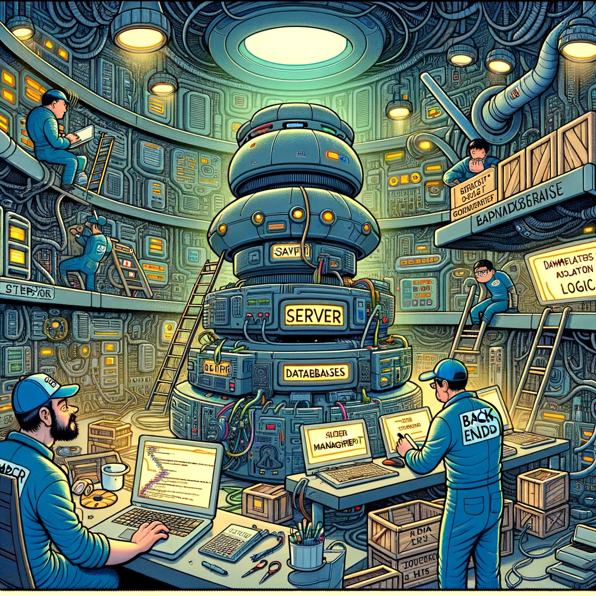

# Back-End Microdegree

Image source: Dall-E by OpenAI

## Objectives

To provide students with a comprehensive overview of server-side application development, from fundamental programming concepts and software development methodologies to databases and application interface creation. The goal of the course is to ensure that students can design, build, and manage application interfaces that meet client expectations.

## Learning Outcomes

- The student is familiar with modern software development principles.
- The student uses a code management environment, `Github`, to manage code and documentation throughout the course.
- The student understands and applies fundamental programming constructs such as data types, loops, conditionals, and functions.
- The student is familiar with relational database principles, designs, and implements a database that meets the needs of the application interface.
- The student independently creates an application interface that meets given requirements using `NodeJS` and the `Express` framework.

## Prerequisites

- Basic computer skills.
- Interest in programming and software development.
- Prior programming experience is not required.

## Completion Requirements

- Participation in lectures and submission of independent work.
- Independent work involves solving various tasks related to programming and software development.
- At the end of the course, the student independently creates an application interface that meets the given requirements using `NodeJS` and the `Express` framework.

## Assessment Criteria

- The application interface created as an assignment meets the specified requirements.
- Use of the code management environment to manage code and documentation.
- Availability and quality of the documentation.

## Courses

- [Software Development](/Software-Development/README.md)
- [Programming Basics](/Programming-Basics/README.md)
- [Back-End Frameworks](/Back-End-Frameworks/README.md)
- [Databases](/Databases/README.md)

## Lectures

### Common Lectures

- [First Lecture](/Lessons/Common-Lessons/Lesson-01/README.md)
- [Second Lecture](/Lessons/Common-Lessons/Lesson-02/README.md)
- [Third Lecture](/Lessons/Common-Lessons/Lesson-03/README.md)
- [Fourth Lecture](/Lessons/Common-Lessons/Lesson-04/README.md)
- [Fifth Lecture](/Lessons/Common-Lessons/Lesson-05/README.md)
- [Sixth Lecture](/Lessons/Common-Lessons/Lesson-06/README.md)
- [Seventh Lecture](/Lessons/Common-Lessons/Lesson-07/README.md)
- [Eighth Lecture](/Lessons/Common-Lessons/Lesson-08/README.md)
- [Ninth Lecture](/Lessons/Common-Lessons/Lesson-09/README.md)
- [Tenth Lecture](/Lessons/Common-Lessons/Lesson-10/README.md)

## Back-End Lectures

- [First Lecture](/Lessons/Back-End/Lesson-01/README.md)
- [Second Lecture](/Lessons/Back-End/Lesson-02/README.md)
- [Third Lecture](/Lessons/Back-End/Lesson-03/README.md)
- [Fourth Lecture](/Lessons/Back-End/Lesson-04/README.md)
- [Fifth Lecture](/Lessons/Back-End/Lesson-05/README.md)
- [Sixth Lecture](/Lessons/Back-End/Lesson-06/README.md)
- [Seventh Lecture](/Lessons/Back-End/Lesson-07/README.md)
- [Eighth Lecture](/Lessons/Back-End/Lesson-08/README.md)
- [Ninth Lecture](/Lessons/Back-End/Lesson-09/README.md)
- [Tenth Lecture](/Lessons/Back-End/Lesson-10/README.md)
