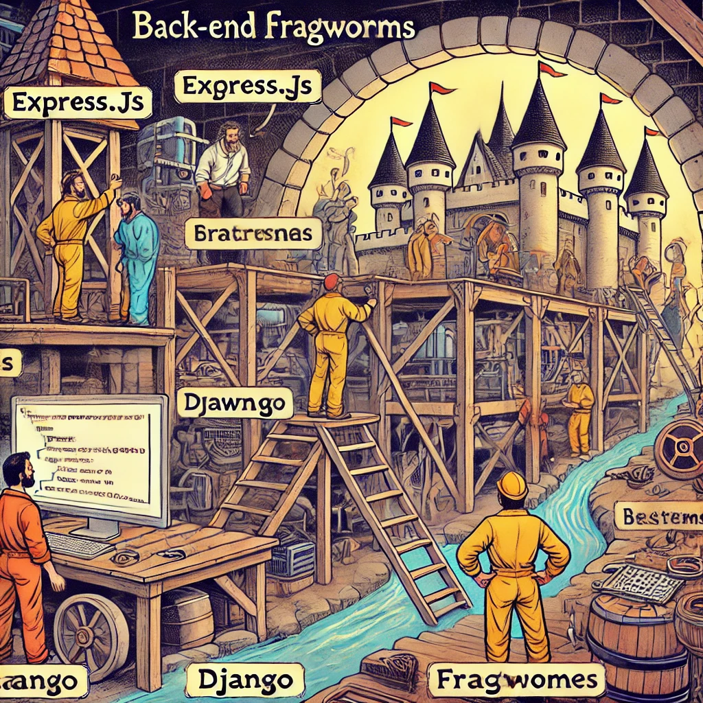

# Back-End Frameworks

Image source: Dall-E by OpenAI

Back-End frameworks provide an in-depth exploration of modern server-side application development methods, tools, and best practices. Students dive into core concepts such as routing, middleware, authentication, and database operations. Throughout the course, students engage in practical projects, building performance-driven and secure applications ready for real-world scenarios. This journey also introduces an extensive set of tools and an ecosystem essential for modern back-end development.

## Description

- **Credits**: 4 ECTS (4 x 26 hours)
- **Course Objectives**: The goal of this course is to develop students' skills in using modern back-end frameworks to build resilient, scalable, and secure server-side applications.

By the end of the course, students should be proficient in server architecture principles, API development, database integration, and the broader ecosystem related to modern back-end development.

## Learning Outcomes

Upon completing this course, the student:

- Builds a CRUD API using the Express.js framework.
- Uses Express middleware to control the request/response cycle.
- Integrates a database to store API data.
- Implements authentication and authorization for API users to manage access control.

## Topics

- Introduction
- [Tools](./Topics/Tools/README.md)
- [API](./Topics/API/README.md)
- [HTTP](./Topics/HTTP/README.md)
- [HTTP Methods](./Topics/HTTP-Methods/README.md)
- [Express](./Topics/Express/README.md)
- [Structuring](./Topics/Structuring/README.md)
- [Sending Data to API](./Topics/Sending-Data-To-Express/README.md)
- [Middleware](./Topics/Middleware/README.md)
- [Express Router](./Topics/Routes/README.md)
- [Authentication and Authorization](./Topics/Auth/README.md)
- [Bcrypt](./Topics/Bcrypt/README.md)
- [JWT](./Topics/JWT/README.md)
- [Sending Data to Express API - Header](./Topics/Sending-Data-To-Express/README.md#header)
- [Automated Testing](./Topics/Testing-Node-API/README.md)
- [Error Handling](./Topics/Error-Handling/README.md)
- [Logging](./Topics/Logging/README.md)

## Lectures (tentative plan, subject to change during the course)

### First Lecture: Introduction to Back-End Frameworks

Credits: 8 hours.

- Introduction
- [Tools](./Topics/Tools/README.md)
- [API](./Topics/API/README.md)
- [HTTP](./Topics/HTTP/README.md)
- [HTTP Methods](./Topics/HTTP-Methods/README.md)
- [Express](./Topics/Express/README.md)
- [Structuring](./Topics/Structuring/README.md)

### Second Lecture (Zoom): Sending Data to API

Credits: 4 hours.

- Review of the previous lecture
- [Structuring](./Topics/Structuring/README.md) - Controllers
- [Sending Data to API](./Topics/Sending-Data-To-Express/README.md)
  - Query string
  - Body
- Using API tools
  - Thunder Client

### Third Lecture: Review

Credits: 8 hours.

- Review of the previous lecture
- Recap:
  - Structuring
  - Sending Data to API

### Fourth Lecture (Zoom): Middleware

Credits: 4 hours.

- Review of the previous lecture
- [Middleware](./Topics/Middleware/README.md)
- [Express Router](./Topics/Routes/README.md)

### Fifth Lecture: Authentication and Authorization

Credits: 8 hours.

- Review of the previous lecture
- [Authentication and Authorization](./Topics/Auth/README.md)
- [Bcrypt](./Topics/Bcrypt/README.md)
- [JWT](./Topics/JWT/README.md)
- [Sending Data to Express API - Header](./Topics/Sending-Data-To-Express/README.md#header)
- Implementing authentication and authorization
