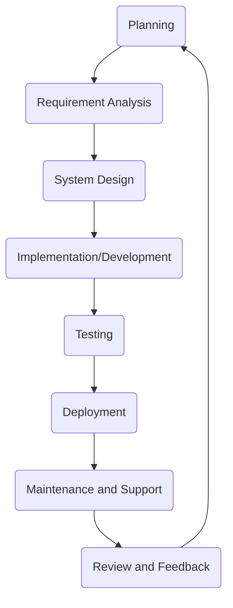

# Software Development Life Cycle (SDLC):

- [Software Development Life Cycle (SDLC):](#software-development-life-cycle-sdlc)
  - [Typical SDLC Phases:](#typical-sdlc-phases)
  - [Importance of SDLC:](#importance-of-sdlc)
  - [Common SDLC Frameworks:](#common-sdlc-frameworks)
    - [**Waterfall Model:**](#waterfall-model)
    - [**Iterative Model:**](#iterative-model)
    - [**Spiral Model:**](#spiral-model)
    - [**Agile Model:**](#agile-model)
    - [**V-Model (Validation and Verification):**](#v-model-validation-and-verification)
    - [**Big Bang Model:**](#big-bang-model)
    - [**Incremental Model:**](#incremental-model)
    - [**Rapid Application Development (RAD):**](#rapid-application-development-rad)
    - [**Scrum (A type of Agile approach):**](#scrum-a-type-of-agile-approach)

The Software Development Life Cycle (SDLC) is a systematic process for planning, creating, testing, deploying, and maintaining software. It defines the stages and tasks involved in producing software from inception to retirement.

## Typical SDLC Phases:

The Software Development Life Cycle (SDLC) is a structured process that defines the phases or steps involved in producing software. While there are different models or frameworks for SDLC, many share common phases. Here's an overview of the typical steps involved:

1. **Planning:**
    - Determine the scope of the project.
    - Identify potential risks, constraints, and resources.
    - Develop a project plan, including timelines, milestones, and budget estimates.

2. **Requirement Analysis:**
    - Gather and document the needs and specifications from stakeholders.
    - Analyze the feasibility of requirements.
    - Prioritize and finalize the list of requirements.

3. **System Design:**
    - Translate requirements into system specifications.
    - Design the system architecture and framework.
    - Create high-level and detailed design documents.
    - Select appropriate technologies, platforms, and tools.

4. **Implementation/Development:**
    - Write the actual code for the software.
    - Translate design documentation into functional software.
    - Integrate various components and ensure they work together.

5. **Testing:**
    - Verify that the software meets the requirements.
    - Identify and fix bugs, errors, and inconsistencies.
    - Use various testing methods like unit testing, integration testing, system testing, acceptance testing, etc.
    - Validate the software's functionality, performance, security, and usability.

6. **Deployment:**
    - Prepare the environment for the software's launch.
    - Install and configure the software in the production environment.
    - Provide necessary training to end-users if required.
    - Monitor the software's performance and ensure smooth operation.

7. **Maintenance and Support:**
    - Address any issues or bugs that arise post-deployment.
    - Provide updates, patches, or enhancements based on user feedback.
    - Ensure the software remains operational, efficient, and relevant over time.
    - Address any security vulnerabilities or compatibility issues that may arise.

8. **Review and Feedback:**
    - Gather feedback from stakeholders and end-users.
    - Analyze the software's performance and identify areas for improvement.
    - Plan for the next iteration or version of the software.

Each of these phases can be iterative, especially in agile or spiral models, where the software is developed in cycles or iterations. The exact steps and their sequence can vary based on the SDLC model chosen, organizational processes, and the nature of the project. However, the aim remains consistent: to produce high-quality software that aligns with user needs and expectations in an organized and efficient manner.

## Importance of SDLC:

- **Structured Process:** SDLC offers a structured approach to software development, ensuring that critical steps are not missed.
- **Quality Assurance:** Each phase of the SDLC has specific deliverables and review processes, leading to better software quality.
- **Risk Management:** Early identification of issues or risks allows for timely mitigation.
- **Project Management:** SDLC offers a clear framework for project managers to track progress, allocate resources, and adhere to budgets.
- **Stakeholder Communication:** By defining clear phases and deliverables, stakeholders are kept in the loop regarding progress and expected outcomes.
- **Efficiency and Cost-effectiveness:** By systematically addressing the software development process, wastage is minimized, and efficiency is improved.
- **Documentation:** Proper documentation is an integral part of the SDLC, ensuring that knowledge is preserved and system details are well understood.

## Common SDLC Frameworks:

### **Waterfall Model:**

- A linear and sequential approach where each phase depends on the deliverables of the previous phase.
- Phases include: Requirement Analysis, System Design, Implementation, Integration and Testing, Deployment, and Maintenance.

### **Iterative Model:**

- Software is developed in iterations, with each iteration building and improving upon the previous one.
- Focuses on refining software in repetitive cycles.

### **Spiral Model:**

- Combines the iterative model's approach with the systematic phases of the waterfall model.
- Involves repetitive cycles/iterations, each cycle involving risk assessment and refinement.

### **Agile Model:**

- Emphasizes flexibility, collaboration, and customer feedback.
- Iterative approach with rapid cycles known as "sprints."
- Popular frameworks under the Agile umbrella include Scrum, Kanban, and Extreme Programming (XP).

### **V-Model (Validation and Verification):**

- An extension of the Waterfall model where the development stage is associated with a testing phase.
- Development and testing activities run in parallel, making it more systematic.

### **Big Bang Model:**

- Development starts with little planning, relying more on luck and spontaneous generation of code.
- More chaotic and less systematic, but can be suitable for small projects or prototypes.

### **Incremental Model:**

- The software is developed in parts, known as increments.
- Each increment represents a portion of the complete system's functionality.

### **Rapid Application Development (RAD):**

- Focuses on rapid prototyping to gather customer feedback and iterate.
- Prioritizes speed and adaptability.

### **Scrum (A type of Agile approach):**

- Organizes software development into short, fixed-length iterations called sprints.
- Uses roles like Product Owner, Scrum Master, and Development Team.

In conclusion, the choice of SDLC framework often depends on the nature of the project, organizational preferences, team size, project scope, and other factors. The ultimate aim is to produce high-quality software that meets user expectations while maintaining a time and budgetary framework.
