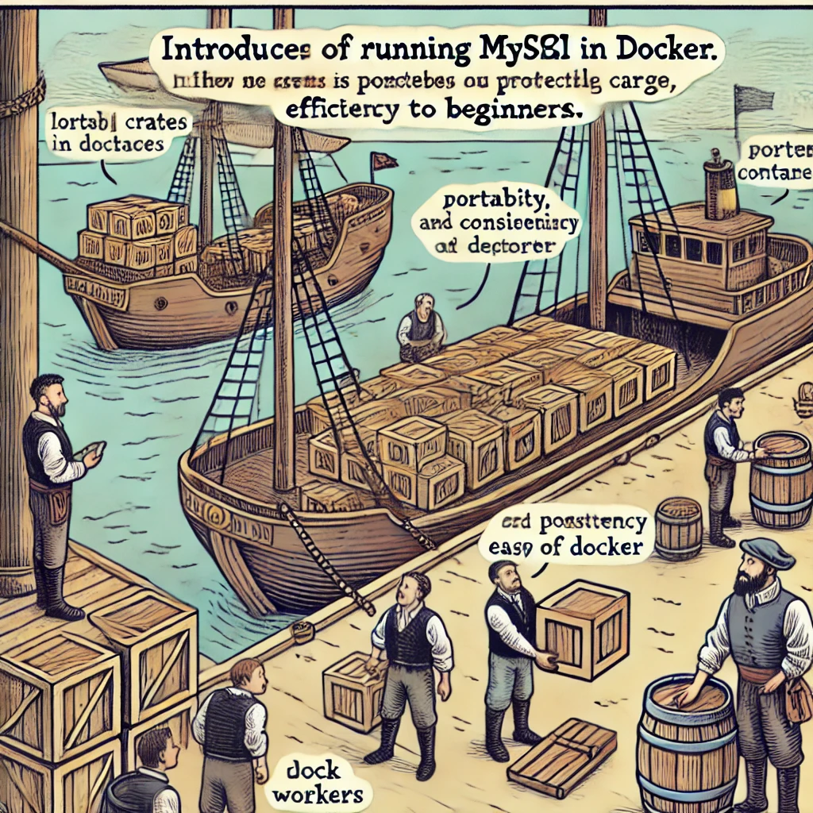

# MySQL and Docker: Managing Databases with Containers

Docker is a container management platform that allows developers to create, test, and deploy applications in isolated environments. Docker simplifies MySQL database setup and management by providing a container-based solution. This chapter covers how to use MySQL with Docker.



Image source: [Dall-E by OpenAI](https://openai.com/)

- [MySQL and Docker: Managing Databases with Containers](#mysql-and-docker-managing-databases-with-containers)
  - [Learning Outcomes](#learning-outcomes)
  - [Basic Docker Concepts](#basic-docker-concepts)
  - [Installing Docker](#installing-docker)
  - [Creating a MySQL Container in Docker](#creating-a-mysql-container-in-docker)
    - [Pulling and Running a MySQL Container](#pulling-and-running-a-mysql-container)
    - [Configuring the MySQL Container](#configuring-the-mysql-container)
    - [Data Persistence](#data-persistence)
  - [Database Operations in a MySQL Container](#database-operations-in-a-mysql-container)
    - [Creating a New Database](#creating-a-new-database)
    - [Creating Tables](#creating-tables)
    - [Inserting Data](#inserting-data)
    - [Selecting Data](#selecting-data)
    - [Updating Data](#updating-data)
    - [Deleting Data](#deleting-data)
  - [Resources](#resources)
  - [Review Questions or Exercises](#review-questions-or-exercises)
  - [Exercise](#exercise)

## Learning Outcomes

By the end of this chapter, students should be able to:

- Explain the fundamental concepts and benefits of Docker.
- Install Docker on their system.
- Create and manage a MySQL container in Docker.
- Perform basic database operations within a MySQL container.

## Basic Docker Concepts

- **Container**: An isolated environment that allows applications and their dependencies to be packaged and run as a single unit.
- **Image**: A read-only template from which containers are created. The image contains all the necessary files and dependencies for running an application.
- **Dockerfile**: A script containing instructions to build a Docker image.
- **Docker Hub**: A cloud-based image registry where users can pull pre-built images or upload their own.

## Installing Docker

Docker installation depends on the operating system. Below are installation instructions for Windows, macOS, and Linux.

- **Windows and macOS**: Download and install Docker Desktop from the [official Docker website](https://www.docker.com/products/docker-desktop).
- **Linux**: Install Docker by following the instructions for your distribution, using package managers like `apt-get` or `yum`.

Example for Linux:

```bash
sudo apt-get update
sudo apt-get install docker-ce docker-ce-cli containerd.io
```

## Creating a MySQL Container in Docker

### Pulling and Running a MySQL Container

To create and run a MySQL container, use Docker command-line tools.

```bash
docker pull mysql:latest
```

Run the MySQL container:

```bash
docker run --name mysql-container -e MYSQL_ROOT_PASSWORD=my-secret-pw -d mysql:latest
```

- `--name mysql-container`: Assigns a name to the container.
- `-e MYSQL_ROOT_PASSWORD=my-secret-pw`: Sets the root user password.
- `-d`: Runs the container in detached mode (background).

### Configuring the MySQL Container

Once the container is running, you can connect to it and configure MySQL.

Connect to the MySQL container:

```bash
docker exec -it mysql-container mysql -u root -p
```

After entering the password, you will have access to the MySQL command-line interface.

### Data Persistence

To ensure data persistence, Docker volumes can be used. Volumes allow data to be stored outside the container so that it remains even after the container is removed.

Run the MySQL container with a volume:

```bash
docker run --name mysql-container -e MYSQL_ROOT_PASSWORD=my-secret-pw -v /my/local/data:/var/lib/mysql -d mysql:latest
```

- `-v /my/local/data:/var/lib/mysql`: Maps a local directory (`/my/local/data`) to the container's MySQL data directory (`/var/lib/mysql`).

## Database Operations in a MySQL Container

### Creating a New Database

```sql
CREATE DATABASE my_database;
```

### Creating Tables

```sql
CREATE TABLE Employees (
    ID INT AUTO_INCREMENT PRIMARY KEY,
    Name VARCHAR(100),
    Position VARCHAR(100),
    Salary DECIMAL(10, 2)
);
```

### Inserting Data

```sql
INSERT INTO Employees (Name, Position, Salary)
VALUES ('John Doe', 'Developer', 3000.00);
```

### Selecting Data

```sql
SELECT * FROM Employees;
```

### Updating Data

```sql
UPDATE Employees
SET Salary = 3500.00
WHERE Name = 'John Doe';
```

### Deleting Data

```sql
DELETE FROM Employees
WHERE Name = 'John Doe';
```

## Resources

- [Docker Official Documentation](https://docs.docker.com/)
- [MySQL Docker Documentation](https://hub.docker.com/_/mysql)
- [Learning Docker by Jeeva S. Chelladhurai](https://www.amazon.com/Learning-Docker-Jeeva-Chelladhurai/dp/1783984869)
- [Docker for Developers by Richard Bullington-McGuire](https://www.amazon.com/Docker-Developers-Richard-Bullington-McGuire/dp/1789617384)
- [MySQL Official Documentation](https://dev.mysql.com/doc/)

## Review Questions or Exercises

- What is a Docker container, and how does it differ from a Docker image?
- Write the command to create a MySQL container in Docker, setting the root password to "password123".
- How can data persistence be ensured in a MySQL container? Explain and provide an example.
- Write an SQL statement to create a table named "Products" with the following columns: ID (primary key), Name (text), Price (decimal), Quantity (integer).

## Exercise

- Create a MySQL container named "school-mysql" and set the root user password to "schoolpass".
- Connect to the "school-mysql" container and create a database named "School".
- Inside the "School" database, create a table named "Teachers" with the following columns: ID (primary key), FirstName (text), LastName (text), Subject (text).
- Insert three sample records into the "Teachers" table.
- Write an SQL query to select all teachers who teach mathematics.
- Write an SQL command to update the "FirstName" value to "Jane" for a teacher whose "LastName" is "Doe".
- Write an SQL query to delete a record from the "Teachers" table where the teacher teaches English.

This chapter provides an overview of using MySQL with Docker, offering practical examples and exercises to help students gain a deeper understanding of the topic.
