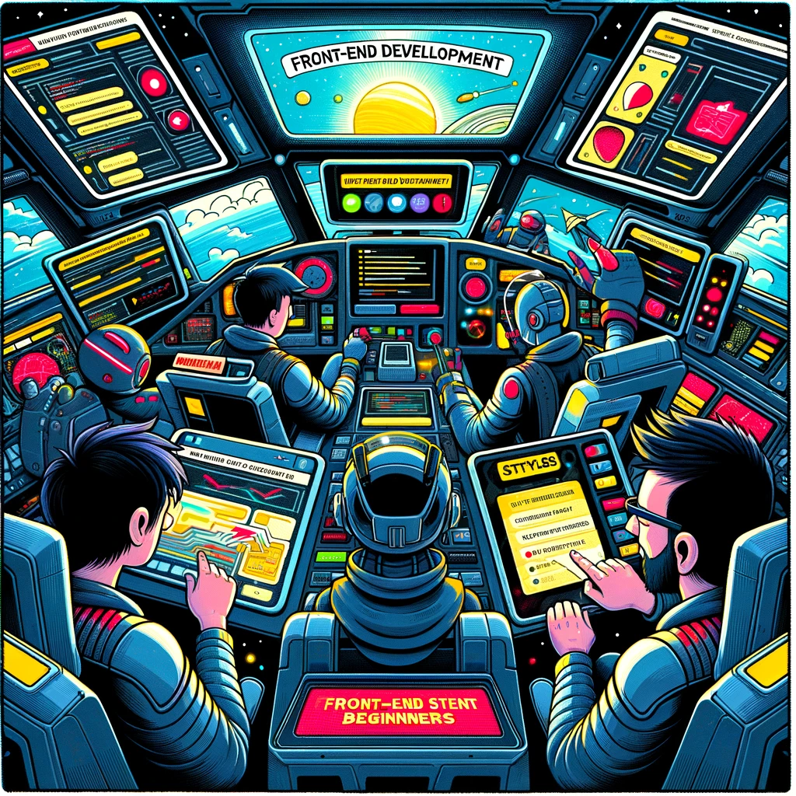

# Front-End Development Microdegree

Image source: Dall-E by OpenAI

## Objectives

To provide the student with a thorough understanding of the principles, tools, best practices, and skills necessary for creating interactive and user-friendly websites.

## Learning Outcomes

- The student is familiar with modern software development principles.
- The student uses a code management environment, `Github`, to manage code and documentation throughout the course.
- The student understands and applies fundamental programming constructs such as data types, loops, conditionals, and functions.
- The student is familiar with and applies `HTML`, `CSS`, and `JavaScript` technologies for website creation.
- The student independently creates a dynamic website that meets the given requirements using the `ReactJS` framework.

## Prerequisites

- Basic computer skills.
- Interest in programming and software development.

> Prior programming experience is not required.

## Completion Requirements

- Participation in lectures and submission of independent work.
- Independent work involves solving various tasks related to programming and software development.
- At the end of the course, the student independently creates a dynamic website that meets the given requirements using the `ReactJS` framework.

## Assessment Criteria

- The completed website meets the specified requirements.
- Use of the code management environment to manage code and documentation.
- Availability and quality of the documentation.

## Courses

- [Software Development](/Software-Development/README.md)
- [Programming Basics](/Programming-Basics/README.md)
- [Front-End Technologies](/Front-End-Technologies/README.md)
- [Front-End Frameworks](/Front-End-Frameworks/README.md)

## Lectures

### Common Lectures

- [First Lecture](/Lessons/Common-Lessons/Lesson-01/README.md)
- [Second Lecture](/Lessons/Common-Lessons/Lesson-02/README.md)
- [Third Lecture](/Lessons/Common-Lessons/Lesson-03/README.md)
- [Fourth Lecture](/Lessons/Common-Lessons/Lesson-04/README.md)
- [Fifth Lecture](/Lessons/Common-Lessons/Lesson-05/README.md)
- [Sixth Lecture](/Lessons/Common-Lessons/Lesson-06/README.md)
- [Seventh Lecture](/Lessons/Common-Lessons/Lesson-07/README.md)
- [Eighth Lecture](/Lessons/Common-Lessons/Lesson-08/README.md)
- [Ninth Lecture](/Lessons/Common-Lessons/Lesson-09/README.md)
- [Tenth Lecture](/Lessons/Common-Lessons/Lesson-10/README.md)

## Front-End Lectures

- [First Lecture](/Lessons/Front-End/Lesson-01/README.md)
- [Second Lecture](/Lessons/Front-End/Lesson-02/README.md)
- [Third Lecture](/Lessons/Front-End/Lesson-03/README.md)
- [Fourth Lecture](/Lessons/Front-End/Lesson-04/README.md)
- [Fifth Lecture](/Lessons/Front-End/Lesson-05/README.md)
- [Sixth Lecture](/Lessons/Front-End/Lesson-06/README.md)
- [Seventh Lecture](/Lessons/Front-End/Lesson-07/README.md)
- [Eighth Lecture](/Lessons/Front-End/Lesson-08/README.md)
- [Ninth Lecture](/Lessons/Front-End/Lesson-09/README.md)
- [Tenth Lecture](/Lessons/Front-End/Lesson-10/README.md)
