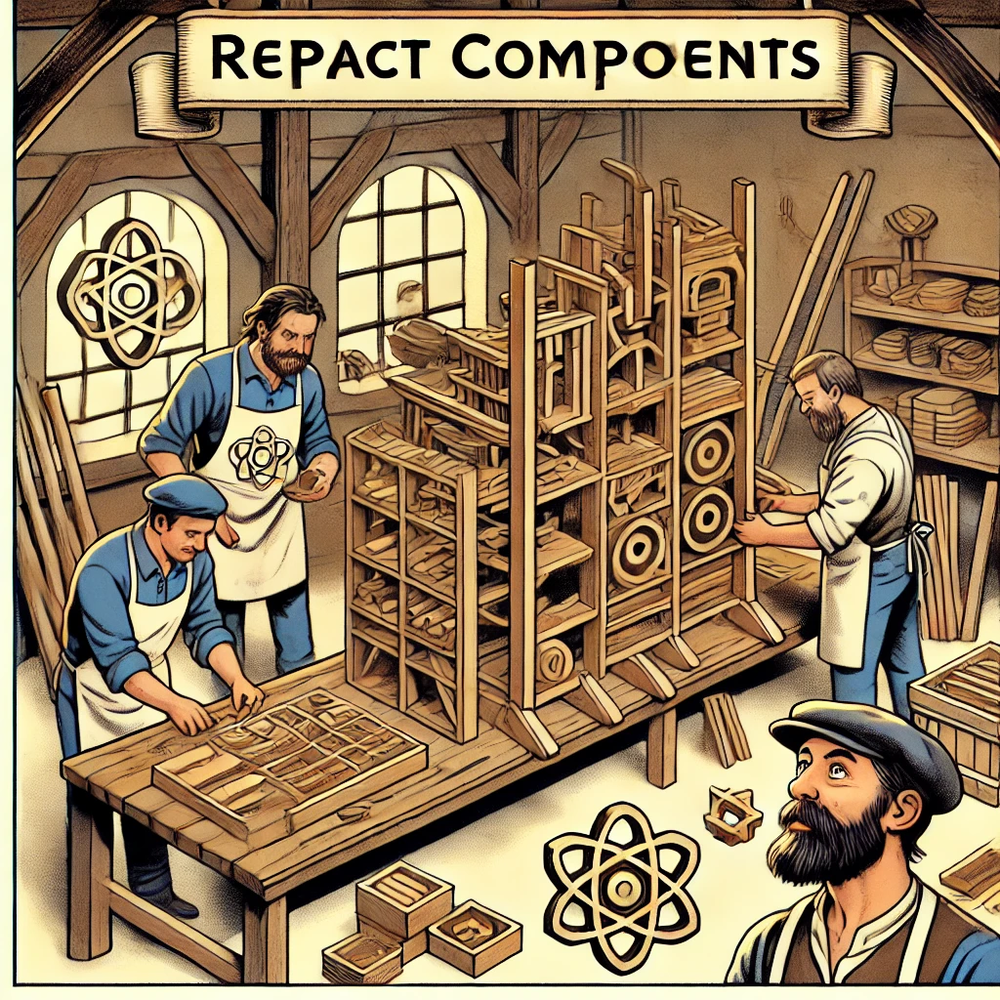

# React Components

React is a popular JavaScript library for building user interfaces. The core concept and building block of React is the **component**. Components allow developers to break down a user interface into small, reusable pieces, making development and maintenance easier.



- [React Components](#react-components)
  - [Learning Outcomes](#learning-outcomes)
  - [What is a React Component?](#what-is-a-react-component)
    - [Functional Components](#functional-components)
      - [Example: Functional Component](#example-functional-component)
    - [Class-Based Components](#class-based-components)
      - [Example: Class-Based Component](#example-class-based-component)
  - [Props](#props)
    - [Example: Using Props](#example-using-props)
  - [State](#state)
    - [Example: Using State in a Class-Based Component](#example-using-state-in-a-class-based-component)
    - [Example: Using State in a Functional Component (Hooks)](#example-using-state-in-a-functional-component-hooks)
  - [Composing Components](#composing-components)
    - [Example: Component Composition](#example-component-composition)
  - [Lifecycle Methods](#lifecycle-methods)
    - [Key Lifecycle Methods](#key-lifecycle-methods)
      - [Example: Using Lifecycle Methods](#example-using-lifecycle-methods)

## Learning Outcomes

By the end of this chapter, students should be able to:

- Explain what a React component is and why it is important.
- Create and use different types of components (functional and class-based).
- Use props and state to manage data and communication between components.

## What is a React Component?

A **component** is a self-contained, reusable piece of code that defines part of the user interface. Each component can contain HTML, JavaScript, and CSS. In React, there are two main types of components: **functional components** and **class-based components**.

### Functional Components

Functional components are JavaScript functions that take props as input and return React elements.

#### Example: Functional Component

```javascript
import React from "react";

function Welcome(props) {
  return <h1>Hello, {props.name}!</h1>;
}

export default Welcome;
```

### Class-Based Components

Class-based components are JavaScript classes that extend the `React.Component` class. These components can maintain their own state and lifecycle methods.

#### Example: Class-Based Component

```javascript
import React, { Component } from "react";

class Welcome extends Component {
  render() {
    return <h1>Hello, {this.props.name}!</h1>;
  }
}

export default Welcome;
```

## Props

**Props** (short for "properties") are data passed from a parent component to a child component. Props allow components to receive dynamic values and display them accordingly.

### Example: Using Props

```javascript
import React from "react";
import Welcome from "./Welcome";

function App() {
  return (
    <div>
      <Welcome name="Alice" />
      <Welcome name="Bob" />
      <Welcome name="Charlie" />
    </div>
  );
}

export default App;
```

In this example, the `Welcome` component receives a `name` prop and displays a greeting message.

## State

**State** is a component's internal data storage that can change over time. Updating state triggers a re-render to reflect the changes in the UI.

### Example: Using State in a Class-Based Component

```javascript
import React, { Component } from "react";

class Counter extends Component {
  constructor(props) {
    super(props);
    this.state = { count: 0 };
  }

  increment = () => {
    this.setState({ count: this.state.count + 1 });
  };

  render() {
    return (
      <div>
        <p>Count: {this.state.count}</p>
        <button onClick={this.increment}>Increment</button>
      </div>
    );
  }
}

export default Counter;
```

### Example: Using State in a Functional Component (Hooks)

React Hooks (`useState`, `useEffect`, etc.) allow functional components to manage state and other React features.

```javascript
import React, { useState } from "react";

function Counter() {
  const [count, setCount] = useState(0);

  return (
    <div>
      <p>Count: {count}</p>
      <button onClick={() => setCount(count + 1)}>Increment</button>
    </div>
  );
}

export default Counter;
```

## Composing Components

**Component composition** involves combining smaller components into larger, more complex components. This approach enhances reusability and maintainability.

### Example: Component Composition

```javascript
import React from "react";

function Header() {
  return (
    <header>
      <h1>My App</h1>
    </header>
  );
}

function Footer() {
  return (
    <footer>
      <p>© 2024 My App</p>
    </footer>
  );
}

function Main() {
  return (
    <main>
      <p>Welcome to my app!</p>
    </main>
  );
}

function App() {
  return (
    <div>
      <Header />
      <Main />
      <Footer />
    </div>
  );
}

export default App;
```

## Lifecycle Methods

**Lifecycle methods** are special methods in class-based components that allow developers to execute code at different stages of a component’s existence. These methods handle component initialization, updates, and destruction.

### Key Lifecycle Methods

1. **componentDidMount**: Called after the component has been added to the DOM.
2. **componentDidUpdate**: Called when the component's props or state change.
3. **componentWillUnmount**: Called just before the component is removed from the DOM.

#### Example: Using Lifecycle Methods

```javascript
import React, { Component } from "react";

class LifecycleDemo extends Component {
  componentDidMount() {
    console.log("Component mounted");
  }

  componentDidUpdate(prevProps, prevState) {
    console.log("Component updated");
  }

  componentWillUnmount() {
    console.log("Component will unmount");
  }

  render() {
    return <div>Lifecycle Demo</div>;
  }
}

export default LifecycleDemo;
```
