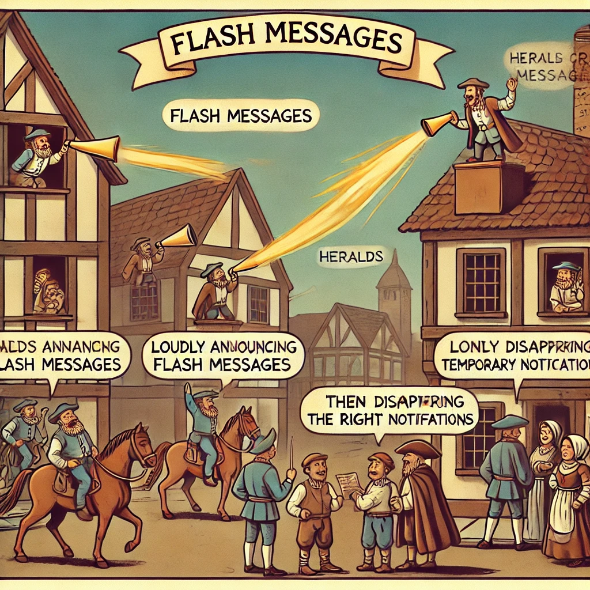

# React Flash Messages

Flash messages are an essential way to provide users with quick, temporary feedback, such as after successful login, data submission, or error occurrences. In React, flash messages can be implemented using various approaches, ranging from basic state management (`useState` and `useEffect`) to leveraging third-party libraries like `react-toastify`. This guide explores both methods.



Image source: Dall-E by OpenAI

- [React Flash Messages](#react-flash-messages)
  - [Learning Objectives](#learning-objectives)
  - [What Are Flash Messages?](#what-are-flash-messages)
  - [1. Flash Messages Using `useState` and `useEffect`](#1-flash-messages-using-usestate-and-useeffect)
    - [Creating the FlashMessage Component](#creating-the-flashmessage-component)
    - [FlashMessage Styles](#flashmessage-styles)
    - [Using Flash Messages in the Application](#using-flash-messages-in-the-application)
    - [Explanation](#explanation)
  - [2. Flash Messages Using `react-toastify`](#2-flash-messages-using-react-toastify)
    - [Installation](#installation)
    - [Using `react-toastify` in an Application](#using-react-toastify-in-an-application)
    - [Selgitus](#selgitus)
    - [Customizing `react-toastify`](#customizing-react-toastify)

---

## Learning Objectives

By the end of this guide, you should be able to:

- Explain what flash messages are and why they are useful.
- Create a simple flash message component using `useState` and `useEffect`.
- Use the `react-toastify` library to add enhanced flash messages to a React app.
- Integrate flash messages into a React application and trigger them based on specific actions.

---

## What Are Flash Messages?

Flash messages are temporary notifications displayed to users for a short duration to provide feedback. Examples include:

- Success notifications (e.g., "Login successful").
- Error messages (e.g., "Failed to save data").
- Informational messages (e.g., "Settings have been updated").

---

## 1. Flash Messages Using `useState` and `useEffect`

### Creating the FlashMessage Component

Here's a simple `FlashMessage` component that displays a message and hides it automatically after a specified duration.

```javascript
// FlashMessage.js
import React, { useState, useEffect } from "react";
import "./FlashMessage.css"; // Styles for the flash messages

const FlashMessage = ({ message, type, duration = 3000 }) => {
  const [isVisible, setIsVisible] = useState(true);

  useEffect(() => {
    const timer = setTimeout(() => {
      setIsVisible(false);
    }, duration);

    return () => clearTimeout(timer); // Cleanup the timer
  }, [duration]);

  if (!isVisible) return null;

  return <div className={`flash-message ${type}`}>{message}</div>;
};

export default FlashMessage;
```

### FlashMessage Styles

Add simple styles to distinguish message types (e.g., success, error, info).

```css
/* FlashMessage.css */
.flash-message {
  padding: 10px;
  margin: 10px 0;
  border-radius: 5px;
  color: #fff;
  text-align: center;
  position: fixed;
  top: 20px;
  right: 20px;
  z-index: 1000;
  opacity: 0.9;
}

.flash-message.success {
  background-color: #4caf50; /* Green */
}

.flash-message.error {
  background-color: #f44336; /* Red */
}

.flash-message.info {
  background-color: #2196f3; /* Blue */
}
```

### Using Flash Messages in the Application

Trigger flash messages based on actions, such as after a login attempt.

```javascript
// LoginPage.js
import React, { useState } from "react";
import FlashMessage from "./FlashMessage";
import "./FlashMessage.css";

const LoginPage = () => {
  const [username, setUsername] = useState("");
  const [password, setPassword] = useState("");
  const [flashMessage, setFlashMessage] = useState(null);

  const handleLogin = () => {
    if (username === "user" && password === "password") {
      // Näita edu sõnumit
      setFlashMessage({ message: "Login successful!", type: "success" });
    } else {
      // Näita tõrkesõnumit
      setFlashMessage({
        message: "Login failed. Please try again.",
        type: "error",
      });
    }
  };

  return (
    <div>
      <h2>Login</h2>
      <input
        type="text"
        value={username}
        onChange={(e) => setUsername(e.target.value)}
        placeholder="Username"
      />
      <input
        type="password"
        value={password}
        onChange={(e) => setPassword(e.target.value)}
        placeholder="Password"
      />
      <button onClick={handleLogin}>Login</button>

      {flashMessage && (
        <FlashMessage
          message={flashMessage.message}
          type={flashMessage.type}
          duration={3000}
        />
      )}
    </div>
  );
};

export default LoginPage;
```

### Explanation

- **FlashMessage Component**: Accepts `message`, `type` and `duration` props. Hides itself automatically after the specified duration.
- **`useEffect` with `setTimeout`**: Used to hide the message after a given duration.
- **CSS Styles**: Position the message and distinguish between message types visually.

## 2. Flash Messages Using `react-toastify`

`react-toastify` is a popular library for creating flash messages or "toasts." It offers advanced features and an excellent user experience.

### Installation

Install `react-toastify` using npm:

```bash
npm install react-toastify
```

### Using `react-toastify` in an Application

```javascript
// App.js
import React from "react";
import { BrowserRouter as Router, Routes, Route } from "react-router-dom";
import { ToastContainer, toast } from "react-toastify";
import "react-toastify/dist/ReactToastify.css";
import HomePage from "./HomePage";
import LoginPage from "./LoginPage";
import Dashboard from "./Dashboard";

const App = () => {
  return (
    <Router>
      <Routes>
        <Route path="/" element={<HomePage />} />
        <Route path="/login" element={<LoginPage />} />
        <Route path="/dashboard" element={<Dashboard />} />
      </Routes>
      <ToastContainer />
    </Router>
  );
};

export default App;
```

### Selgitus

- **`ToastContainer`**: The container for all toast messages. Include it in your root component (e.g., App.js).
- **`toast` Functions**: Functions like `toast.success` and `toast.error` trigger flash messages.

### Customizing `react-toastify`

You can customize the appearance and behavior of `react-toastify` :

```javascript
toast.success("Success Message", {
  position: toast.POSITION.TOP_RIGHT,
  autoClose: 5000,
  hideProgressBar: false,
  closeOnClick: true,
  pauseOnHover: true,
  draggable: true,
  progress: undefined,
});
```
