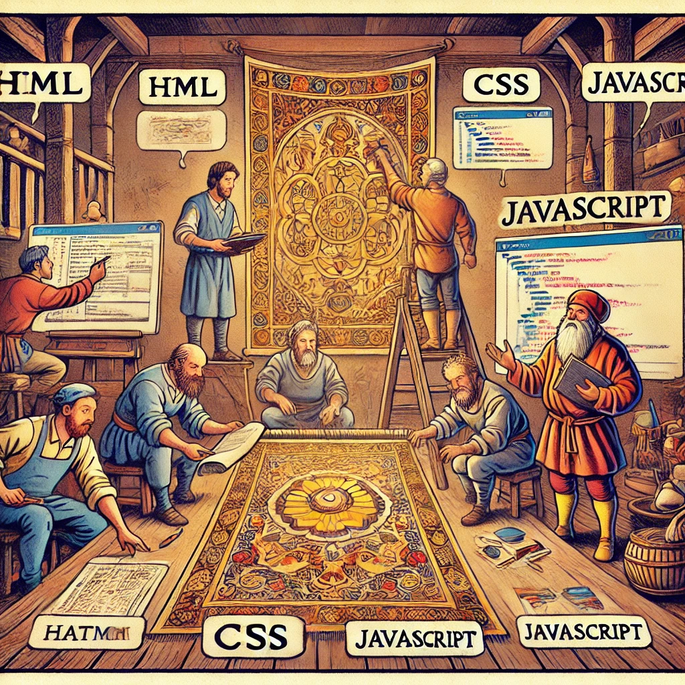

# Front-End Technologies

Image source: Dall-E by OpenAI

**"Front-End Technologies"** offers an in-depth exploration of the tools, techniques, and best practices that drive modern web interfaces. This course introduces students to the front-end trifecta of web development: HTML for structuring content, CSS for styling and layout, and JavaScript for interactivity and dynamic behavior. Through a combination of theory and practical work, students will tackle projects that challenge them to build visually appealing and functionally strong web pages and applications.

## Description

- **Credits**: 4 ECTS (4 x 26 hours)
- **Course Objectives**: The goal of the "Front-End Technologies" course is to equip students with the skills and knowledge necessary to design and develop interactive, user-friendly, and responsive web interfaces.

By the end of the course, students should be proficient in the core front-end technologies, understand the principles of web design, and be able to create modern web interfaces that meet the needs of various users and devices.

## Learning Outcomes

Upon completing this course, students will be able to:

- Create a webpage using HTML, CSS, and JavaScript that adheres to HTML and CSS standards.
- Use JavaScript to listen for events on the webpage and respond to them.
- Use various input elements to gather and use data on a webpage.

## Topics

- [HTML](./Topics/HTML/README.md)
  - [Semantic HTML](./Topics/Semantic-HTML/README.md)
- [CSS](./Topics/CSS/README.md)
- [DOM](./Topics/DOM/README.md)
- [Node vs Browser](./Topics/NodeJS-vs-JS/README.md)
- [JavaScript in Browser](./Topics/Javascript-in-Browser/README.md)
  - [Simple Input and Output](./Topics/Primitive-Input-Output/README.md)
  - [JS Events](./Topics/Events/README.md)
  - [DOM Manipulation](./Topics/Manipulating-DOM/README.md)
- [HTML Forms](./Topics/HTML-Forms/README.md)
- [HTML Forms and JavaScript](./Topics/Forms-and-JS/README.md)
- [Axios](./Topics/Axios/README.md)
- [Local Storage](./Topics/Localstorage/README.md)
- [Cookies](./Topics/Cookies/README.md)
- [CSS Grid](./Topics/CSS-Grid/README.md)
- [CSS Opacity and Visibility](./Topics/Opacity-Visibility/README.md)
- [CSS Position](./Topics/CSS-Position/README.md)
- [CSS Display](./Topics/CSS-Display/README.md)
- [CSS Display Flex](./Topics/CSS-Display-Flex/README.md)
- [CSS Box Model](./Topics/CSS-Box-Model/README.md)
- [CSS Border](./Topics/Border/README.md)
- [Shapes with CSS](./Topics/Shapes-with-CSS/README.md)
- [CSS Frameworks](./Topics/CSS-Frameworks/README.md)
- [Bootstrap](./Topics/Bootstrap/README.md)

## Lectures (preliminary plan, subject to change)

### Lecture 1: Introduction to Front-End Technologies

Duration: 8 hours

- Course introduction
- [HTML](./Topics/HTML/README.md)
  - [Semantic HTML](./Topics/Semantic-HTML/README.md)
- [CSS](./Topics/CSS/README.md)

### Lecture 2 (Zoom): CSS and DOM

Duration: 4 hours

- Review of the previous lecture
- [CSS Display](./Topics/CSS-Display/README.md)
- [CSS Display Flex](./Topics/CSS-Display-Flex/README.md)
- [CSS Box Model](./Topics/CSS-Box-Model/README.md)
- [Node vs Browser](./Topics/NodeJS-vs-JS/README.md)
- [JavaScript in Browser](./Topics/Javascript-in-Browser/README.md)
  - [Simple Input and Output](./Topics/Primitive-Input-Output/README.md)
- [DOM](./Topics/DOM/README.md)
- [JS Events](./Topics/Events/README.md)
- [DOM Manipulation](./Topics/Manipulating-DOM/README.md)

### Lecture 3: HTML Forms and JavaScript

Duration: 8 hours

- Review of the previous lecture
- Using multiple `js` files
- [HTML Forms](./Topics/HTML-Forms/README.md)
- [HTML Forms and JavaScript](./Topics/Forms-and-JS/README.md)

### Lecture 4 (Zoom): Axios, Bootstrap

Duration: 4 hours

- Review of the previous lecture
- [CSS Position](./Topics/CSS-Position/README.md)
- [CSS Frameworks](./Topics/CSS-Frameworks/README.md)
- [Bootstrap](./Topics/Bootstrap/README.md)
- Fetching data from an external source
  - [Axios](./Topics/Axios/README.md)

### Lecture 5: Authentication and Authorization

Duration: 8 hours

- Review of the previous lecture
- [Authentication and Authorization](../Back-End-Frameworks/Topics/Auth/README.md)
- [Browser Memory Technologies](./Topics/Browser-Memory/README.md)
- [JWT](../Back-End-Frameworks/Topics/JWT/README.md)
- [Sending Headers with Axios](./Topics/Axios/README.md#sending-headers-with-axios)
