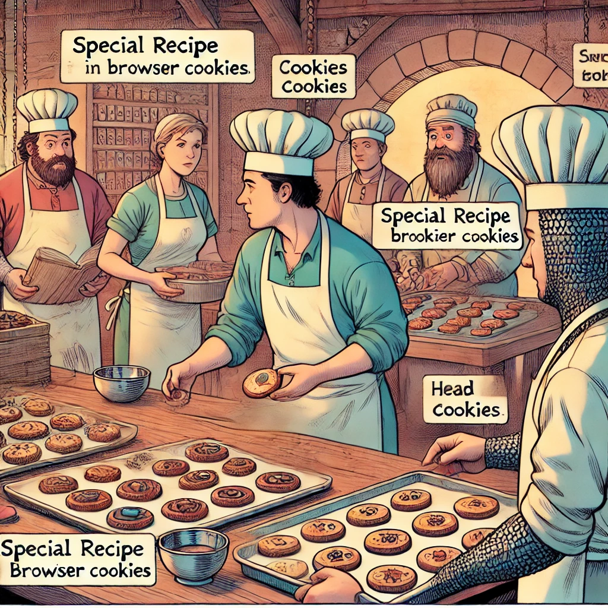

# Using Cookies in Web Applications

This guide covers the basics of cookies, their use in web applications, and how to handle cookies securely. Cookies are small text files that web servers use to store and retrieve information on users' devices, enabling user-friendly features.



Image source: Dall-E by OpenAI

- [Using Cookies in Web Applications](#using-cookies-in-web-applications)
  - [Learning Outcomes](#learning-outcomes)
  - [What Are Cookies?](#what-are-cookies)
  - [Types of Cookies](#types-of-cookies)
  - [Using Cookies in JavaScript](#using-cookies-in-javascript)
    - [Creating a Cookie](#creating-a-cookie)
    - [Reading a Cookie](#reading-a-cookie)
    - [Deleting a Cookie](#deleting-a-cookie)
  - [Cookie Security and Privacy](#cookie-security-and-privacy)
  - [Summary](#summary)
  - [References](#references)

## Learning Outcomes

After completing this topic, you will be able to:

- Explain what cookies are and their purpose;
- Create, read, and delete cookies using JavaScript;
- Understand the security and privacy aspects of cookies.

## What Are Cookies?

Cookies are small text files stored in a user's browser when visiting a website. These files can store information such as user preferences, session identifiers, authentication data, and more. Cookies allow websites to "remember" information about users to enhance user experience and provide personalized features.

## Types of Cookies

- **Session Cookies**: Temporary cookies deleted when the user closes the browser. They are often used for login sessions and shopping cart data.
- **Persistent Cookies**: Remain on the user's device for a longer time and are commonly used to remember preferences or track users for advertising purposes.
- **Third-Party Cookies**: Created by domains other than the one the user is visiting. These are primarily used for advertising and analytics services.

## Using Cookies in JavaScript

### Creating a Cookie

To create a cookie, set the `document.cookie` property. Use the `expires` or `max-age` attribute to define its lifespan.

```javascript
document.cookie = "username=JohnDoe; expires=Fri, 31 Dec 2021 23:59:59 GMT";
```

### Reading a Cookie

Cookies are accessible via the `document.cookie` property as a semicolon-separated string, which can be parsed to retrieve specific values.

```javascript
const cookies = document.cookie.split(";");
const username = cookies
  .find((row) => row.startsWith("username"))
  .split("=")[1];
console.log(username);
```

### Deleting a Cookie

A cookie can be deleted by setting its expiration date to a past date.

```javascript
document.cookie = "username=; expires=Thu, 01 Jan 1970 00:00:00 GMT";
```

## Cookie Security and Privacy

When using cookies, consider the following security and privacy concerns:

- **Security**: Use the `Secure` and `HttpOnly` flags to enhance cookie security. The `HttpOnly` flag prevents cookies from being accessed via JavaScript, protecting against cross-site scripting (XSS) attacks.
- **Privacy:**: Inform users about how and why cookies are used by providing a clear and accessible privacy policy.

## Summary

Cookies are powerful tools for improving user experience and enhancing web application functionality. Proper usage and security measures are essential to protect user data and comply with legal requirements.

## References

- MDN Web Docs - [Cookies](https://developer.mozilla.org/en-US/docs/Web/HTTP/Cookies)
- W3Schools - [JavaScript Cookies](https://www.w3schools.com/js/js_cookies.asp)
