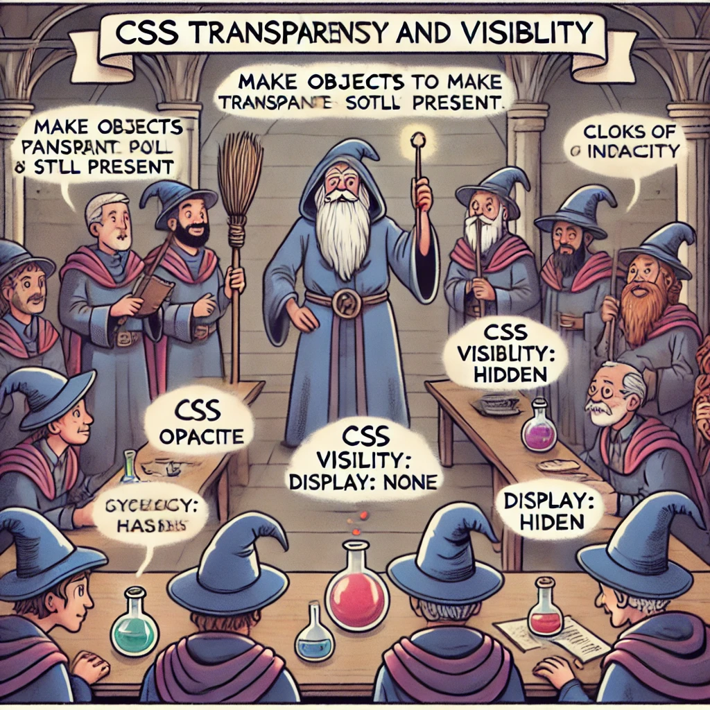

# Object Transparency and Visibility in CSS

This guide explores CSS properties that control the transparency and visibility of HTML elements. These properties are essential in web design, enabling developers to create more dynamic and visually appealing user interfaces.



Image source: Dall-E by OpenAI

- [Object Transparency and Visibility in CSS](#object-transparency-and-visibility-in-css)
  - [Learning Outcomes](#learning-outcomes)
  - [What Are Object Transparency and Visibility?](#what-are-object-transparency-and-visibility)
    - [`Opacity`](#opacity)
      - [Example](#example)
    - [`visibility`](#visibility)
      - [Näide](#näide)
  - [Transparency vs. Visibility](#transparency-vs-visibility)
  - [Practical Usage](#practical-usage)
    - [Interactive Menus](#interactive-menus)
    - [Alert Messages](#alert-messages)
  - [Conclusion](#conclusion)

## Learning Outcomes

After completing this topic, you will be able to:

- Explain the CSS `opacity` and `visibility` properties;
- Apply these properties to control the transparency and visibility of elements;
- Use these properties to enhance user experience.

## What Are Object Transparency and Visibility?

Object transparency and visibility refer to two different ways an element can be partially visible, completely invisible, or fully visible.

### `Opacity`

The CSS `opacity` property sets the transparency level of an element. A value of `1` means the element is fully opaque, while a value of `0` makes the element fully transparent (invisible). Values between `0` and `1` produce varying levels of transparency.

#### Example

```css
.transparent-box {
  background-color: red;
  opacity: 0.5; /* 50% transparency */
}
```

### `visibility`

Unlike `opacity`, which makes an element transparent, the `visibility` property toggles an element's visibility without releasing its space. `visibility: hidden;` hides the element while keeping its space intact, whereas `visibility: visible;` makes the element visible.

#### Näide

```css
.hidden-box {
  visibility: hidden; /* Element is hidden but still occupies space */
}
```

## Transparency vs. Visibility

Although both properties can make an element invisible, there are significant differences in their behavior:

- **Space Requirements**: `opacity: 0;` keeps the element in the flow and occupies its space, while `visibility: hidden;` does the same but disables user interaction with the element.
- **Animations**: `opacity` can be smoothly animated, transitioning an element gradually between transparent and opaque states. `visibility` does not support smooth transitions, as it toggles the element's state immediately.

## Practical Usage

### Interactive Menus

Transparency can be used to create interactive menus that fade in when needed.

```css
.menu {
  opacity: 0;
  transition: opacity 0.5s ease;
}

.menu:hover {
  opacity: 1;
}
```

### Alert Messages

The `visibility` property is helpful for creating alert messages that appear conditionally while maintaining the page layout.

```css
.alert {
  visibility: hidden;
}

.alert.active {
  visibility: visible;
}
```

## Conclusion

CSS `opacity` and `visibility` properties offer flexible ways to control the transparency and visibility of elements. Understanding and using these properties effectively can create better user experiences by combining aesthetic appeal with functionality. Use them creatively to add visual depth and interactivity to your web pages.
