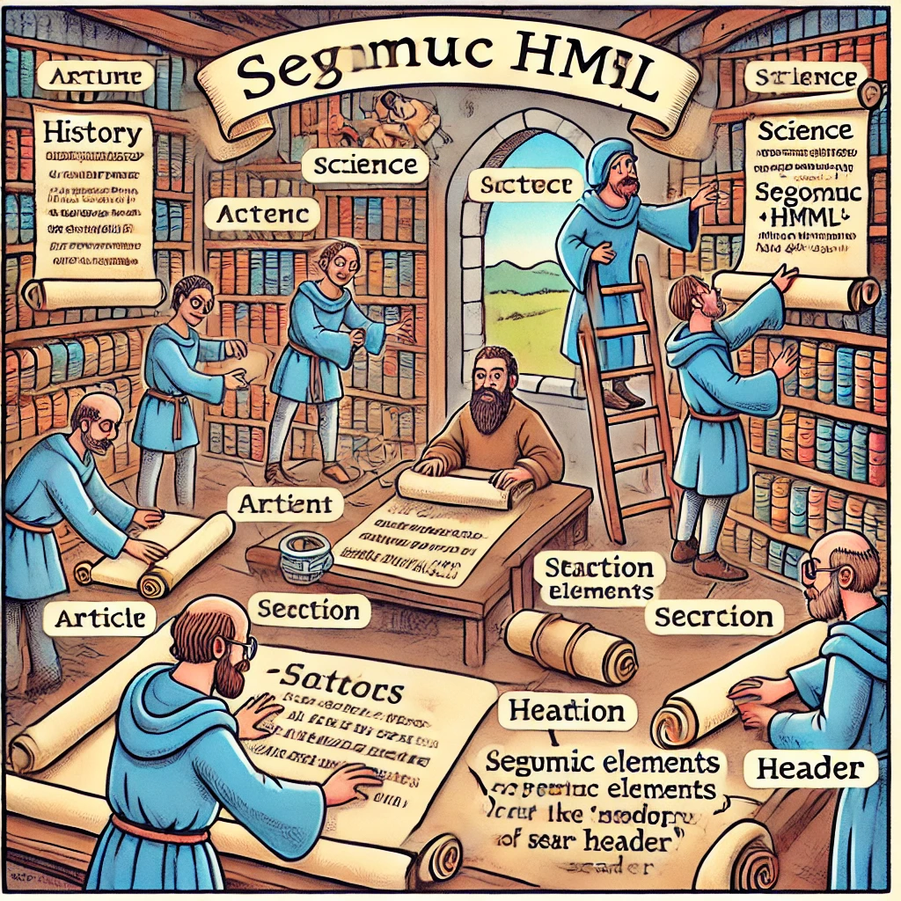

# Semantic HTML

In this topic, you'll learn about semantic HTML and why it's important to use it when building webpages.

Image source: Dall-E by OpenAI

- [Semantic HTML](#semantic-html)
  - [Learning Outcomes](#learning-outcomes)
  - [What is Semantic HTML?](#what-is-semantic-html)
  - [Why Use Semantic HTML?](#why-use-semantic-html)
  - [How to Use Semantic HTML](#how-to-use-semantic-html)

## Learning Outcomes

After completing this topic, you'll be able to:

## What is Semantic HTML?

Semantic HTML refers to the use of HTML markup to reinforce the semantics, or meaning, of the content. In other words, it's about using HTML tags that describe their purpose and the type of content they enclose, not just how they should appear on the page. For example, `<article>`, `<footer>`, `<header>`, `<nav>`, and `<section>` are semantic elements that clearly describe the role or meaning of the content they contain.

## Why Use Semantic HTML?

- **Accessibility**: Screen readers and other assistive technologies rely on semantic HTML to provide a better experience for users with disabilities. For instance, screen readers can navigate a webpage more effectively when the content is properly marked up with semantic tags.
- **SEO Benefits**: Search engines prefer websites that have clear, descriptive, semantic markup. It makes it easier for them to understand the content of the page, which can lead to better search rankings.
- **Maintainability and Readability**: Semantic HTML makes the structure of a webpage clearer, thus making it easier for developers to understand, maintain, and update the code.
- **Cross-Device Compatibility**: Properly structured content using semantic HTML is more likely to be consistently rendered across different devices and browsers.

## How to Use Semantic HTML

Using semantic HTML involves choosing the most appropriate HTML elements to mark up the content on your webpage. Here are some examples:

- **`<header>`**: Used for introductory content or a set of navigational links. It typically contains the site's logo, the main navigation menu, or the title of the current section.

- **`<nav>`**: Designates a section of a page that links to other pages or to parts within the page. It's for primary navigation blocks.

- **`<article>`**: Specifies independent, self-contained content which could be independently distributed or reused (e.g., in syndication).

- **`<section>`**: Represents a standalone section of functionality or a thematic grouping of content.

- **`<footer>`**: Represents the footer of a document or section, typically containing authorship information, related documents, copyright, and contact information.

- **`<aside>`**: Used for content tangentially related to the content around it, like a sidebar.

- **`<h1>` to `<h6>`**: Header tags used to define headings. `<h1>` represents the most important heading, while `<h6>` represents the least important.

- **`<figure>` and `<figcaption>`**: Used for marking up diagrams, illustrations, photos, and code listings, along with their caption.

- **`<main>`**: Represents the dominant content of the body of a document, excluding footers, headers, navigation, and sidebars.

- **`<mark>`**: Indicates text that is marked or highlighted for reference or notation purposes.

- **`<time>`**: Used to represent either a time on a 24-hour clock or a precise date in the Gregorian calendar (with optional time and timezone information).

- **`
` and `
`**: Used to create a disclosure widget from which the user can obtain additional information or controls.

By using semantic HTML, not only do you structure your content in a meaningful, logical way, but you also contribute to the accessibility and SEO-friendliness of your website. It’s a best practice that enhances the overall quality and effectiveness of your web content.

You can read more about semantic HTML in the [MDN Web Docs](https://developer.mozilla.org/en-US/docs/Glossary/Semantics).
