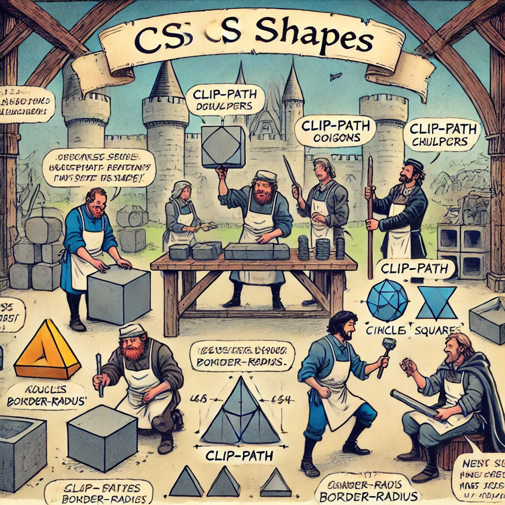

# Creating Shapes with CSS

In this tutorial, we will learn how to use CSS to create various geometric shapes, such as squares, circles, and other shapes. CSS provides simple ways to create these shapes, which can contribute to making web pages more attractive and dynamic.



Image source: Dall-E by OpenAI

- [Creating Shapes with CSS](#creating-shapes-with-css)
  - [Learning Outcomes](#learning-outcomes)
  - [Squares and Rectangles](#squares-and-rectangles)
    - [Example: Square](#example-square)
    - [Example: Rectangle](#example-rectangle)
  - [Circles](#circles)
    - [Example: Circle](#example-circle)
  - [Ovals](#ovals)
    - [Example: Oval](#example-oval)
  - [Triangles](#triangles)
    - [Example: Triangle](#example-triangle)
  - [More Complex Shapes with `clip-path`](#more-complex-shapes-with-clip-path)
    - [Example: Star Shape](#example-star-shape)
  - [Summary](#summary)

## Learning Outcomes

After completing this topic, you will be able to:

- Create squares and circles using CSS;
- Use CSS to create more complex geometric shapes;
- Apply different CSS properties, such as `border-radius` and `clip-path`, to customize shapes.

## Squares and Rectangles

Creating squares and rectangles is simple, as they only require setting the `width` and `height` properties. To create a square, set the width and height to be equal.

### Example: Square

```css
.square {
  width: 100px;
  height: 100px;
  background-color: #4caf50;
}
```

### Example: Rectangle

```css
.rectangle {
  width: 200px;
  height: 100px;
  background-color: #f44336;
}
```

## Circles

To create a circle, use the `border-radius` property. Set `border-radius` to `50%` to turn the element into a circle.

### Example: Circle

```css
.circle {
  width: 100px;
  height: 100px;
  background-color: #008cba;
  border-radius: 50%;
}
```

## Ovals

To create an oval, set different `width` and `height` values and apply `border-radius: 50%;`.

### Example: Oval

```css
.oval {
  width: 150px;
  height: 100px;
  background-color: #e91e63;
  border-radius: 50%;
}
```

## Triangles

Triangles require creative use of the `border` property. Making some of the `border` sides transparent creates the triangle effect.

### Example: Triangle

```css
.triangle {
  width: 0;
  height: 0;
  border-left: 50px solid transparent;
  border-right: 50px solid transparent;
  border-bottom: 100px solid #ff5722;
}
```

## More Complex Shapes with `clip-path`

The CSS `clip-path` property allows you to create more complex shapes by defining the clipping area, which determines the visible parts of an element.

### Example: Star Shape

```css
.star {
  width: 100px;
  height: 100px;
  background-color: #ffeb3b;
  clip-path: polygon(
    50% 0%,
    61% 35%,
    98% 35%,
    68% 57%,
    79% 91%,
    50% 70%,
    21% 91%,
    32% 57%,
    2% 35%,
    39% 35%
  );
}
```

## Summary

CSS offers many ways to create various shapes, from simple geometric shapes like circles and squares to more complex shapes like triangles and star-like objects. Mastering these techniques can help you create visually interesting web pages and enhance user interface design. Experiment with these shapes to see how they can bring your web projects to life.
