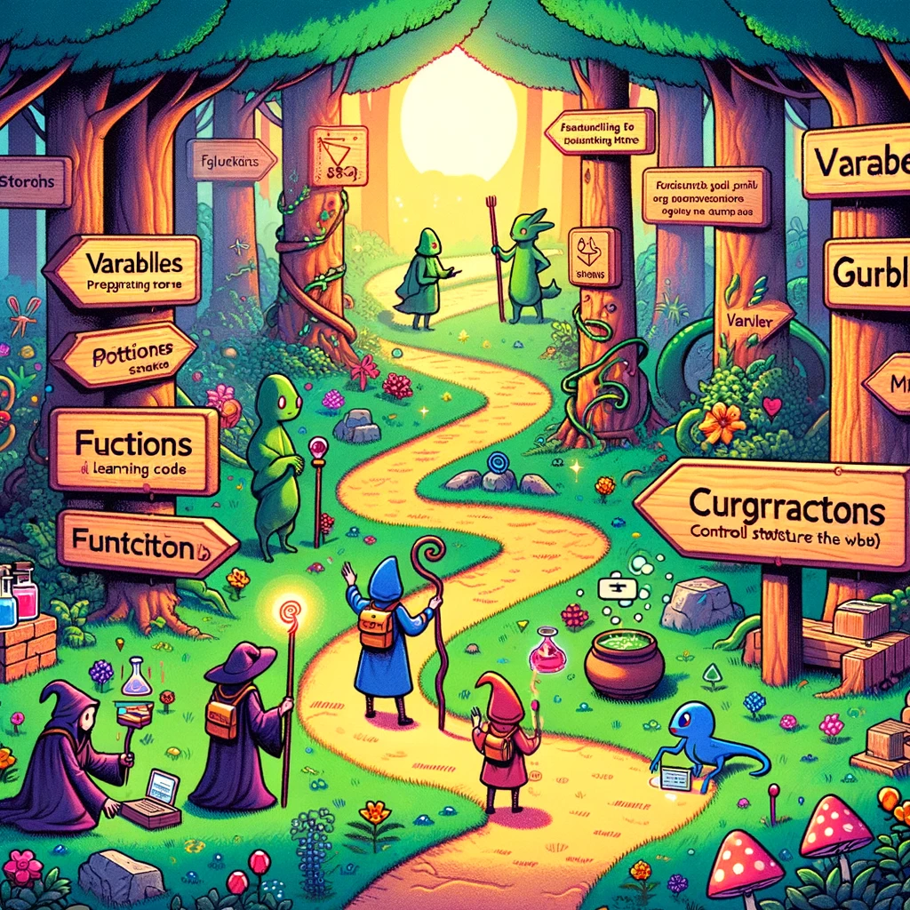

# Fundamentals of Programming

Image source: Dall-E by OpenAI

## Description

**"Fundamentals of Programming"** is an introduction to the world of computer programming. This course for beginners covers the essential concepts that every new programmer needs to know. Students will learn how to use variables, data types, control structures, loops, functions, and simple algorithms. Through practical exercises and projects, students will write and debug their first lines of code, laying the foundation for more advanced studies in software development and computer science. No prior programming experience is required, making this the ideal starting point for anyone interested in learning programming.

- **Credits**: 4 ECTS (4 x 26 hours)
- **Course Objectives**: The goal of the **"Fundamentals of Programming"** course is to introduce students to the core concepts and principles of computer programming.

By the end of the course, students will have a clear understanding of the logical structure of programming, be familiar with the basic syntax of code, and be able to write simple programs to solve computational problems.

## Learning Outcomes

- **Understanding Programming Concepts**: Recognize and use basic programming constructs such as variables, data types, and operators in writing programs.
- **Control Structures**: Apply basic control structures, including loops (e.g., `for`, `while`) and conditionals (e.g., `if-else` statements), to control the flow of the program.
- **Functions and Methods**: Create and use functions/methods to modularize and simplify code, understanding parameters, return values, and function calls.
- **Simple Algorithms**: Write and implement simple algorithms to solve problems, such as searching for a value in a list or sorting numbers in order.
- **Data Structures**: Understand and use basic data structures like arrays and objects to organize and manipulate data.
- **Debugging Skills**: Identify, trace, and resolve basic coding errors (both syntax and logic) using debugging techniques and tools.
- **Problem-Solving Skills**: Analyze simple problems and derive computational solutions through algorithmic thinking.
- **Basic Input/Output**: Implement basic input and output operations for user interaction.

## Learning Materials

Throughout the course, we will use `Github` to share learning materials and submit homework.

Students should follow the sequence of topics and lectures. Each topic will have a `README` file with learning materials and exercises. Exercises need to be solved and uploaded to `Github`. Homework must be submitted before the next lecture.

Learning materials for the next lecture should be reviewed before the class (except for the first lecture). In the lectures, we will discuss topics and solve exercises based on the learned material.

## Topics

- [Introduction](./Topics/Introduction/README.md)
- [Tools](./Topics/Tools/README.md)
- [Javascript](./Topics/Javascript/README.md)
- [Node.JS](./Topics/NodeJS/README.md)
- [Hello World](./Topics/HelloWorld/README.md)
- [Variables](./Topics/Variables/README.md)
- [Data Types](./Topics/Data-Types/README.md)
- [Operators and Expressions](./Topics/Operators/README.md)
- [Conditionals](./Topics/Conditionals/README.md)
- [Truthiness](./Topics/Truthiness/README.md)
- [Algorithms](./Topics/Algorithms/README.md)
- [Loops](./Topics/Loops/README.md)
- [Javascript Best Practices](./Topics/Javascript-Best-Practices/README.md)
- [Data Structures](./Topics/Data-Structures/README.md)
- [Functions](./Topics/Functions/README.md)
- [Modules](./Topics/Modules/README.md)
  - [Built-In Modules](./Topics/Modules-Built-In/README.md)
  - [Third-Party Modules](./Topics/Modules-Third-Party/README.md)
- [NPM](./Topics/NPM/README.md)
- [Debugging](./Topics/Debugging/README.md)
- [Promise](./Topics/Promise/README.md)
- [Async/Await](./Topics/Async-Await/README.md)
- [Callback](./Topics/Callback/README.md)
- [JSON](./Topics/JSON/README.md)
- [NodeMon](./Topics/Nodemon/README.md)
- [Try Catch](./Topics/Try-Catch-Finally/README.md)
- [typeof](./Topics/Typeof/README.md)

---

- [Guard Clause](./Topics/Guard-Clause/README.md)
- [Use of Semicolons](./Topics/Semicolons/README.md)

## Lectures

### Lecture 1: Introduction to the Fundamentals of Programming

Duration: 4 hours

- Course introduction
- [Tools](./Topics/Tools/README.md)
- [Javascript](./Topics/Javascript/README.md)
- [NodeJS](./Topics/NodeJS/README.md)
- [Hello World](./Topics/HelloWorld/README.md)
- [Variables](./Topics/Variables/README.md)
- [Data Types](./Topics/Data-Types/README.md)
- Uploading code to Github
- Exercises

### Lecture 2 (Zoom)

Duration: 2 hours

- Review of the previous lecture
- Resolving issues from homework
- [Operators and Expressions](./Topics/Operators/README.md)
- [Conditionals](./Topics/Conditionals/README.md)
- Uploading code to Github
- Exercises

### Lecture 3

Duration: 4 hours

- Review of the previous lecture
- Resolving issues from homework
- [Algorithms](./Topics/Algorithms/README.md)
- [Truthiness](./Topics/Truthiness/README.md)
- [Data Structures (Arrays)](./Topics/Data-Structures/README.md#arrays)
- [Loops](./Topics/Loops/README.md)
- Exercises

### Lecture 4 (Zoom)

Duration: 2 hours

- Review of the previous lecture
- Resolving issues from homework
- [Data Structures (Objects)](./Topics/Data-Structures/README.md#objects)
- Exercises

### Lecture 5

Duration: 4 hours

- Review of the previous lecture
- Resolving issues from homework
- [Functions](./Topics/Functions/README.md)
- Various built-in Javascript functions (methods)
  - Math.random()
  - Math.floor()
  - Math.ceil()
  - Math.round()
- Exercises

### Lecture 6 (Zoom)

Duration: 2 hours

- Review of the previous lecture
- Resolving issues from homework
- Discussion of questions from previous lectures
- Exercises

### Lecture 7

Duration: 4 hours

- Review of the previous lecture
- Resolving issues from homework
- [Modules](./Topics/Modules/README.md)
  - [Built-In Modules](./Topics/Modules-Built-In/README.md)
  - [Third-Party Modules](./Topics/Modules-Third-Party/README.md)
- [NPM](./Topics/NPM/README.md)
- Exercises

### Lecture 8 (Zoom)

Duration: 2 hours

- Review of the previous lecture
- Resolving issues from homework
- [Javascript Best Practices](./Topics/Best-Practices/README.md)
- [Debugging](./Topics/Debugging/README.md)
- Exercises

### Lecture 9

Duration: 4 hours

- Review of the previous lecture
- [Reading and Writing Files (Built-In Module `fs`)](./Topics/Modules-Built-In/README.md#reading-and-writing-files)
- Synchronous and Asynchronous Code
  - [Callback Functions](./Topics/Callback/README.md)
  - [Async/Await](./Topics/Async-Await/README.md)
- [JSON.stringify() and JSON.parse()](./Topics/JSON/README.md)
- [Try/Catch](./Topics/Try-Catch-Finally/README.md)
- Resolving issues from homework
- Exercises

### Lecture 10 (Zoom)

Duration: 2 hours

- Review of the previous lecture
- Resolving issues from homework
- Final Q&A
