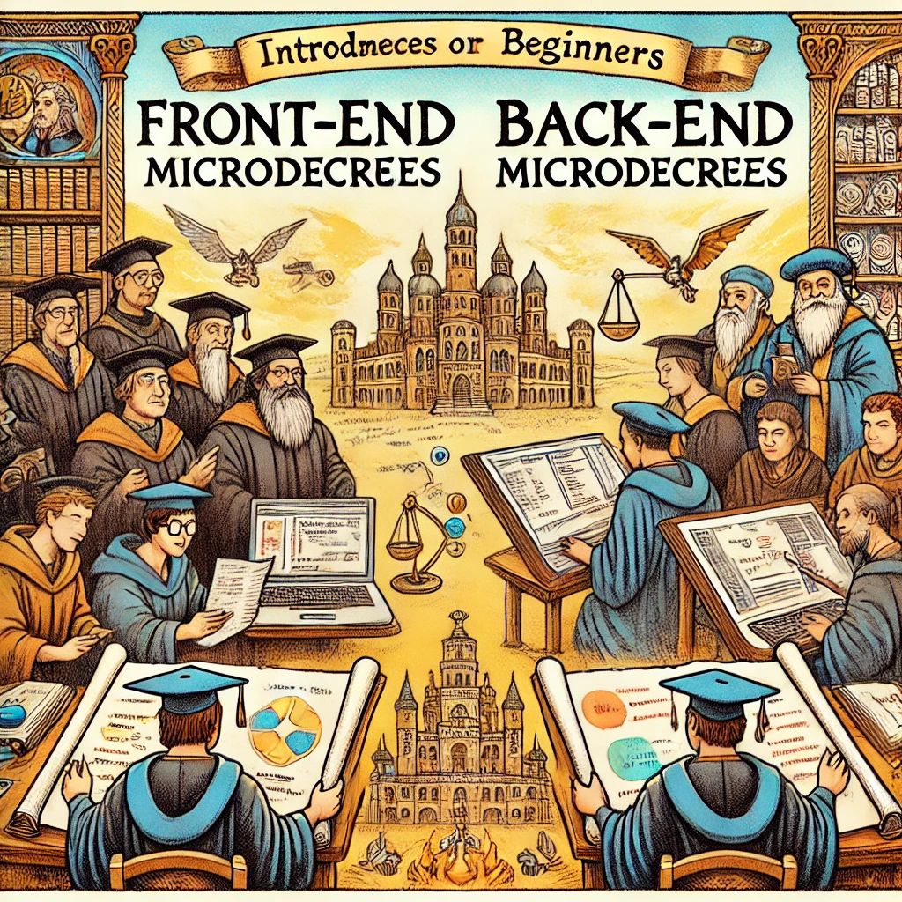
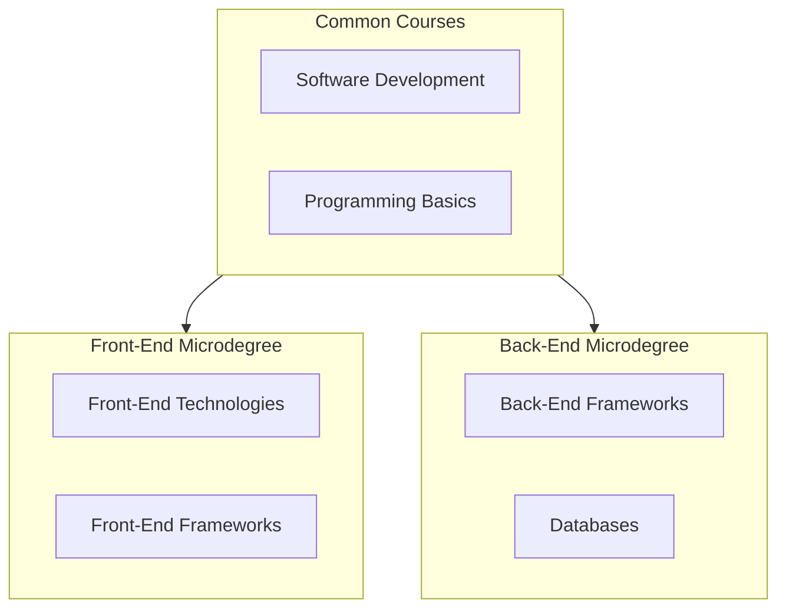

# Web Development Microdegrees

Image source: Dall-E by OpenAI

This repository contains the following Web Development microdegrees:

- [Front-End Development](./FE)
- [Back-End Development](./BE)

The structure of the repository is as follows:

- The [`Subjects`](./) folder contains the learning materials for all courses.
- The [`Lessons`](./Lessons/) folder contains a list of lectures, slides, and references to the learning materials.
  - The [`Common-Lessons`](./Lessons/Common-Lessons/) folder contains common lectures (software development, programming basics).
  - The [`Front-End`](./Lessons/Front-End/) folder contains lectures on Front-End Development.
  - The [`Back-End`](./Lessons/Back-End/) folder contains lectures on Back-End Development.
- The [`Subjects`](./) folder contains each microdegree's courses in separate subfolders by subject.
  - Common Courses
    - The [`Software-Development`](./Software-Development/) folder contains materials for the software development course.
    - The [`Programming-Basics`](./Programming-Basics/) folder contains materials for the programming basics course.
  - Front-End Development
    - The [`Front-End-Technologies`](./Front-End-Technologies/) folder contains materials for the Front-End Development course.
    - The [`Front-End-Frameworks`](./Front-End-Frameworks/) folder contains materials for Front-End Frameworks course.
  - Back-End Development
    - The [`Back-End-Frameworks`](./Back-End-Frameworks/) folder contains materials for Back-End Frameworks course.
    - The [`Databases`](./Databases/) folder contains materials for the Databases course.

The microdegrees were developed as part of the international Erasmus project `2022-2-EE01-KA220-HED-000100317`.

## Study Guide

The learning materials are processed through lectures and independent work. Learning materials, slides, exercises, and independent tasks are available in the repository in the respective folders.

Materials should be studied according to the lectures, where the topics, their order, and references to the materials are described.

After lectures, the student has independent work, where they need to study the materials and solve tasks. During meetings, the teacher provides feedback, answers questions, and helps solve any issues.

### Saving Documents and Materials

Students create a [`Github`](Software-Development/Topics/Github/README.md) account and a personal repository under the [`HK-mikrokraadid`](https://github.com/FE-BE-Microdegrees/) organization, where they save all their work done during the lectures, homework, and other course-related materials. Repositories are private and accessible to both the student and the teacher. Additionally, students grant access to one classmate for collaborative work and feedback.

### Independent Tasks

Before each lecture, students read the materials corresponding to the lecture topics. Those who are diligent may also complete related exercises, although this is not mandatory. The lecture will focus on practical tasks and questions related to the learning materials. After each lecture, students will have independent tasks to complete based on the lecture topics. Independent tasks should be saved in the student's Github repository according to the instructions provided during the lecture.

Homework will be sent to each student's repository as a [`Github Issue`](Software-Development/Topics/Github-Issue/README.md), where the task content will be described in detail.

---

## Microdegree Structure

