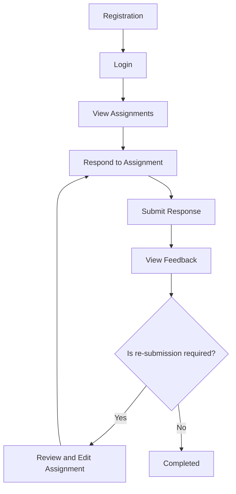

# Example of Process Documentation (User View)

## 1. Overview

**Project Name:** Online Assignment Tracking System

This process documentation from the user's perspective describes how end-users can use the system step-by-step, from registration to completing assignments and receiving feedback. The goal is to ensure that users understand what actions need to be performed and in what order to use the system efficiently.

## 2. User Action Flow

The user process is illustrated in the following mermaid diagram:

- **Registration:** Users must first create an account by entering their email address, password, and other required information.
- **Login:** After registration, users can log into the system using their email and password.
- **View Assignments:** After logging in, users can view their assigned tasks and their deadlines.
- **Respond to Assignment:** Users complete the tasks by answering questions or performing the required actions based on the assignment description.
- **Submit Response:** After completing the task, users can submit their response, including any files or additional information as needed.
- **View Feedback:** Teachers provide feedback on submitted tasks, which users can view in their profile.
- **Review and Edit Assignment:** If feedback requires corrections, users can review and edit their response.
- **Completed:** If re-submission is not required, the task is considered completed.

## 3. Description of User Activities

### 3.1. Registration and Login

- **Registration:** Users create their account by filling out the registration form and verifying their email address. Registration is required to access the system's features.
- **Login:** After account creation, users can log in using their credentials and start using the system.

### 3.2. Assignment Management

- **Viewing Assignments:** Users will see a list of their assignments, including descriptions and deadlines. Viewing assignments helps users plan their tasks and meet deadlines.
- **Responding and Submitting Assignments:** Users complete tasks and submit their responses through the system. After submission, the task awaits grading and feedback from the teacher.

### 3.3. Feedback and Correction

- **Viewing Feedback:** After submission, the teacher provides feedback, which helps the user understand their strengths and areas for improvement.
- **Reviewing and Editing Assignment:** If feedback requires corrections, users can edit and resubmit their response.

## 4. Best Practices for Users

- **Track Deadlines:** Regularly check the deadlines for your assignments to avoid delays and ensure on-time submission.
- **Use Feedback:** Use the feedback provided by the teacher to improve your skills and achieve better results in future tasks.
- **Ask for Help:** Don’t hesitate to contact user support if you need assistance or clarification regarding system usage.

## 5. Summary

The user-facing process documentation helps the end user understand what steps need to be taken to use the system efficiently. Following the correct sequence of actions ensures that the user will have the best experience and be able to fully utilize the system’s capabilities.
