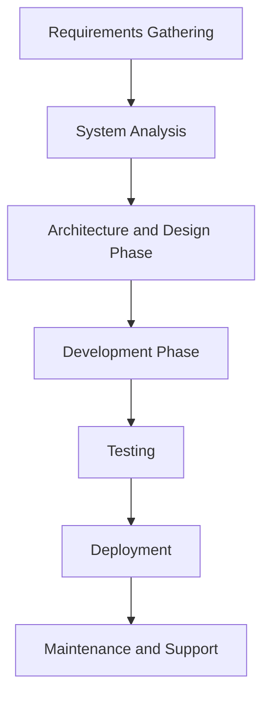

# Example of Project Documentation

## 1. Overview

**Project Name:** Online Assignment Tracking System

The process documentation describes the software development life cycle, covering development, testing, and deployment phases. It helps understand how the project moves from one phase to another and how the project is ensured to be completed successfully.

## 2. Software Development Life Cycle

The development process is divided into several key phases, as shown in the following mermaid diagram:

- **Requirements Gathering:** At the beginning of the project, the requirements from users and stakeholders are collected to define what the system needs to do.
- **System Analysis:** Based on the requirements, a system analysis is done to understand how those requirements will be applied within the system context.
- **Architecture and Design Phase:** The system architecture and design are planned to ensure the solution’s suitability and scalability.
- **Development Phase:** Code is written and components are created based on the system requirements and design.
- **Testing:** The system is thoroughly tested to ensure all features work correctly and meet the requirements.
- **Deployment:** After successful testing, the system is deployed to the production environment.
- **Maintenance and Support:** Post-deployment, the system undergoes maintenance, updates, and user support.

## 3. Development Process

### 3.1. Version Control

- **Git and GitHub:** Git version control software and GitHub repository are used to manage the development process, track changes, and collaborate with team members.
- **Branching Strategy:** The Git Flow strategy is used, with separate branches for development, testing, and production to keep the project organized and avoid conflicts.

### 3.2. Meetings and Communication

- **Sprint Planning:** The development process happens in sprints, where specific goals are set at the beginning of each sprint.
- **Daily Stand-up Meetings:** Short daily meetings allow the development team to share progress and identify potential blockers.

## 4. Testing Process

- **Automated Tests:** Selenium and JUnit are used to run automated tests, ensuring continuous quality control.
- **Manual Tests:** In addition to automated tests, manual tests are conducted to check the user experience and identify potential issues.

## 5. Deployment Process

- **Testing Environment:** Before deployment to the production environment, the system is tested in a staging environment to check its performance.
- **Production Deployment:** An automated CI/CD pipeline (e.g., Jenkins or GitHub Actions) is used to ensure a smooth and error-free deployment process.

## 6. Maintenance and Continuous Improvement

- **Issue Tracking:** All issues and bugs are logged and managed in an issue tracking tool (e.g., Jira).
- **Feedback Collection:** Continuous feedback is gathered from users to make improvements and developments in the system as needed.

## 7. Conclusion

The project process documentation provides an overview of the software development life cycle, describing the different stages from requirements gathering to maintenance and improvement. It ensures that all team members understand the development process and their role in it, helping the project to be successfully completed.
