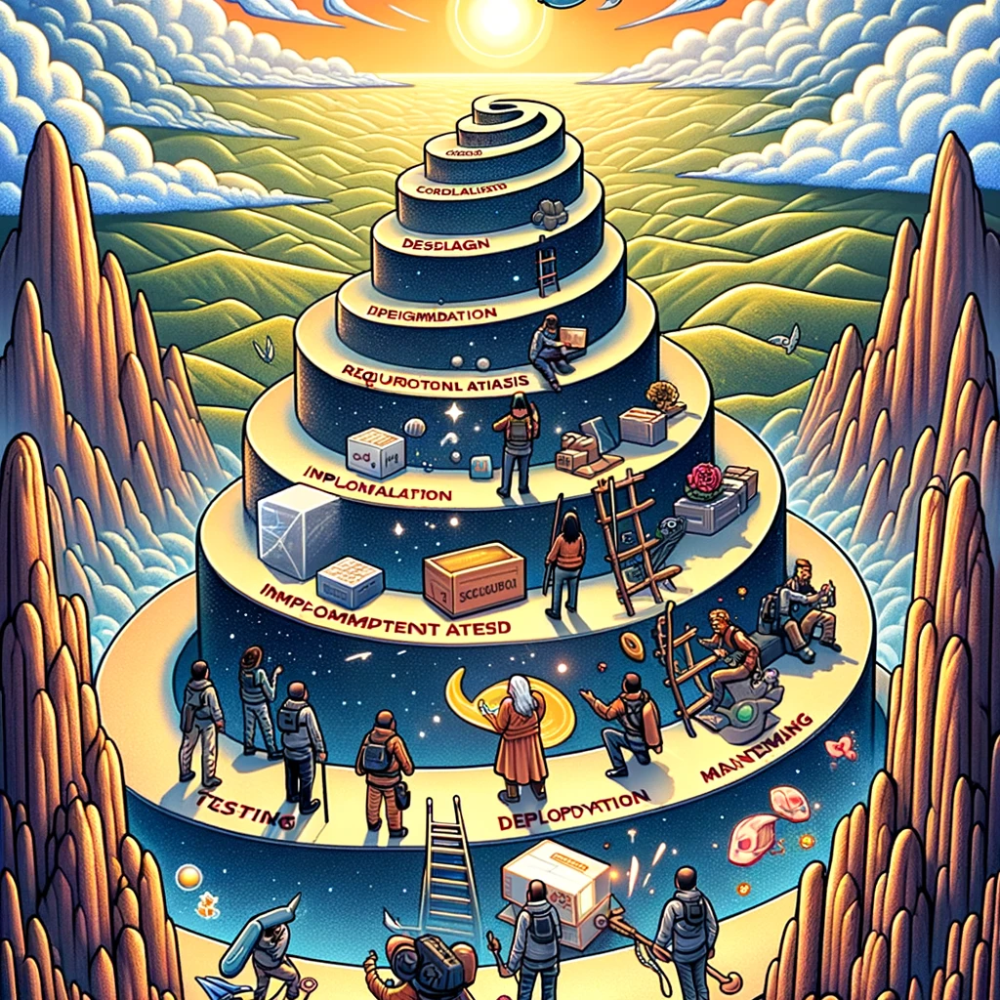
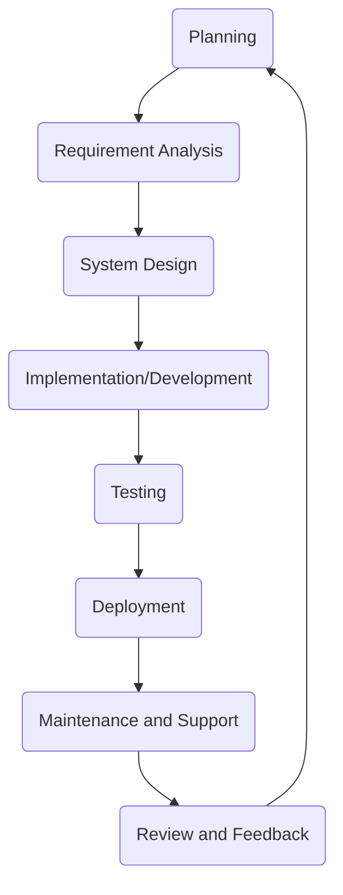

# Software Development Life Cycle (SDLC)

In this topic, we will explore the concept of the Software Development Life Cycle (SDLC), learn about its different phases, and discuss the importance of SDLC in software development.

Image source: Dall-E by OpenAI

- [Software Development Life Cycle (SDLC)](#software-development-life-cycle-sdlc)
  - [Learning Outcomes:](#learning-outcomes)
  - [Typical SDLC Phases](#typical-sdlc-phases)
    - [Planning and Requirements Definition](#planning-and-requirements-definition)
    - [Requirements Definition](#requirements-definition)
    - [Design](#design)
    - [Development](#development)
    - [Testing](#testing)
    - [Deployment](#deployment)
    - [Maintenance and Support](#maintenance-and-support)
    - [Review and Feedback](#review-and-feedback)
  - [Importance of SDLC](#importance-of-sdlc)
  - [Common SDLC Models:](#common-sdlc-models)
    - [**Waterfall Model:**](#waterfall-model)
    - [**Lean**](#lean)
    - [**Spiral Model:**](#spiral-model)
    - [**Agile Model:**](#agile-model)
    - [**Feature-Driven Development (FDD)**](#feature-driven-development-fdd)
    - [**Extreme Programming (XP)**](#extreme-programming-xp)
    - [**Kanban:**](#kanban)
    - [**Scrum:**](#scrum)
  - [Excercises and Assignments](#excercises-and-assignments)

## Learning Outcomes:

After completing this topic, you'll be able to:

- understand the Software Development Life Cycle (SDLC);
- identify the different phases of the SDLC;
- describe the importance of SDLC;
- identify the common SDLC models.
- apply SDLC principles to software development.

The Software Development Life Cycle (SDLC) is a systematic process for planning, creating, testing, deploying, and maintaining software. It defines the stages and tasks involved in producing software from inception to retirement.

## Typical SDLC Phases

The Software Development Life Cycle (SDLC) is a structured process that defines the stages or steps involved in producing software. While there are various models or frameworks for SDLC, many share common phases. Here is an overview of typical steps involved:

### Planning and Requirements Definition

Requirement analysis is the most crucial and fundamental stage of SDLC. It is conducted by team members in collaboration with clients, sales departments, market research, and industry experts. This information is then used to plan the basic approach to the project and conduct a feasibility study in economic, labor, and technical areas.

The planning stage also involves planning for quality assurance requirements and identifying project-related risks. The result of the technical feasibility study is to define different technical approaches that can be followed to successfully implement the project with minimal risks.

This stage may include the following steps:

- Determining project scope.
- Identifying potential risks, constraints, and resources.
- Creating a project plan (including schedules, milestones, and budget estimates).
- Conducting user research to understand user needs and expectations.

### Requirements Definition

Once the requirements analysis is done, the next step is to clearly define and document product requirements and get approval from the client or market analysts. This is done through the Software Requirement Specification (SRS), which contains all the product requirements planned and developed throughout the project life cycle.

This stage may include the following activities:

- Gathering and documenting requirements and needs.
- Collecting specifications from stakeholders (end-users, clients, etc.).
- Feasibility analysis of requirements.
- Prioritizing and confirming the list of requirements.

### Design

The Software Requirements Specification serves as the basis for product architects to come up with the best architecture for the product to be developed. Based on the requirements defined in the Software Requirements Specification, more than one product architecture design solution is usually proposed and documented in the Design Document Specification (DDS).

The Design Document Specification is reviewed by all key stakeholders, and the best design solution for the product is selected based on various parameters such as risk assessment, product robustness, design modularity, budget, and time constraints.

The design approach clearly defines all product architecture modules along with their communication and data flow presentation with external and third-party modules (if any). The interior design of all modules of the proposed architecture should be clearly defined down to the minutest details in the Design Document Specification.

In this stage, the user interface (UI) and user experience (UX) design are also created, which are crucial for engaging users and simplifying the use of the product.

- Translating requirements into system specifications.
- Designing system architecture and framework.
- UX (User Experience) and UI (User Interface) design.
- Selection of appropriate technologies, platforms, and tools.

### Development

In this SDLC phase, actual development and building of the product begin. Programming code is generated at this stage according to the design document specification. If the design has been detailed and organized properly, code can be generated without much trouble.

Developers must follow the coding guidelines defined by their organization, and programming tools such as compilers, debuggers, etc., are used to generate the code. Different high-level programming languages like C, C++, Pascal, Java, Javascript, and PHP are used for coding, depending on the type of software being developed.

- Writing code.
- Transforming design into functional software.
- Integrating various components and ensuring their cooperation.

### Testing

This stage is usually a subset of all stages, as in modern SDLC models, testing activities mostly cover all SDLC stages. However, this stage refers to the product testing stage, where defects in the product are reported, tracked, corrected, and retested until the product reaches the quality standards defined in the SRS.

- Verifying compliance with software requirements.
- Correcting and verifying bugs and discrepancies.
- Applying various testing methods (unit testing, integration testing, manual testing, etc.).
- Validating software functionality, performance, security, and usability.

### Deployment

Once the product is tested and ready for deployment, it is officially released to the relevant market. Sometimes, the product deployment is carried out in stages according to the organization's business strategy. The product might initially be released in a limited segment and tested in a real business environment (UAT – User Acceptance Testing).

The product might then be released in its form or along with recommended enhancements in the target market segment based on feedback.

- Preparing the software launch environment.
- Installing and implementing software in the production environment.
- Training end-users if necessary.
- Monitoring software performance and ensuring smooth operation.

### Maintenance and Support

After the software deployment, it is crucial to ensure that it operates without issues and meets user needs. This involves software maintenance and support to ensure that the software remains operational, efficient, and relevant over time.

- Resolving issues and bugs that arise post-deployment.
- Creating updates, fixes, or enhancements based on user feedback.
- Ensuring that the software remains operational, efficient, and relevant over time.
- Addressing security vulnerabilities and compatibility issues.

### Review and Feedback

The final stage involves reviewing the entire SDLC process and collecting feedback to identify what can be improved in the next iteration or software version. This stage is essential to ensure that the software development process is continuously improved and meets user needs.

- Collecting feedback from stakeholders and end-users.
- Analyzing software performance and identifying areas for improvement.
- Planning the next iteration or software version.

Each of these phases can be iterative, especially in agile or spiral models, where software is developed in cycles or iterations. The exact steps and their order may vary depending on the chosen SDLC model, organizational processes, and the nature of the project. However, the goal is the same: to produce quality software that meets user needs and expectations in the most efficient way possible.

## Importance of SDLC

- **Structured Process:** SDLC provides a structured approach to software development, ensuring that critical steps are not missed.
- **Quality Assurance:** Each phase of SDLC has specific outcomes and review processes that lead to better software quality.
- **Risk Management:** Early identification of possible issues or risks allows for timely mitigation.
- **Project Management:** SDLC provides a clear framework for monitoring project progress, allocating resources, and adhering to budgets.
- **Stakeholder Communication:** By defining clear phases and outcomes, stakeholders are kept informed about progress and expected results.
- **Efficiency and Cost-Effectiveness:** By systematically addressing the software development process, wastage is minimized and efficiency is maximized.
- **Documentation:** Proper documentation is an integral part of SDLC, ensuring that knowledge is preserved and system details are well understood.

## Common SDLC Models:

### **Waterfall Model:**

- **Description:** A linear and sequential approach where each phase must be completed before the next one starts. It's the earliest SDLC approach.
- **Pros:** Clear structure, simple to understand, well-defined stages.
- **Cons:** Difficult to make changes after the phase is complete, not suitable for complex projects.

### **Lean**

- **Description:** Originating from manufacturing, it focuses on resource optimization and customer value delivery. It aims to cut out any "waste" from the process.
- **Pros:** Efficient resource utilization, focuses on delivering value.
- **Cons:** May overlook necessary tasks as "waste," requires a deep understanding to implement correctly.

### **Spiral Model:**

- **Description:** Combines the design phase of the Waterfall model with the iterative philosophy of prototyping. Focuses on risk assessment at every spiral.
- **Pros:** Focus on risk management, flexibility in design and requirements.
- **Cons:** Can be expensive, requires risk assessment expertise.

### **Agile Model:**

- **Description:** An iterative approach to software delivery that builds software incrementally, with a focus on customer feedback and rapid iterations.
- **Pros:** Flexible, promotes iterative feedback, encourages customer involvement.
- **Cons:** Less predictability, can be hard to grasp for those used to traditional methods.

### **Feature-Driven Development (FDD)**

- **Description:** An iterative and incremental software development process driven by feature lists.
- **Pros:** Focus on building and delivering tangible, client-valued functions.
- **Cons:** Not as flexible as other Agile methodologies, requires detailed documentation.

### **Extreme Programming (XP)**

- **Description:** An Agile framework that emphasizes customer satisfaction, with frequent "releases" in short development cycles aimed at improving productivity and introducing checkpoints.
- **Pros:** Emphasizes code quality, encourages customer involvement.
- **Cons:** Requires extensive customer involvement, can be intense for developers.

### **Kanban:**

- **Description:** A visual approach to process management, taking cues from lean manufacturing and emphasizing just-in-time delivery.
- **Pros:** Flexibility, continuous delivery, visual nature helps in identifying bottlenecks.
- **Cons:** Less structured, can lead to scope creep if not managed correctly.

### **Scrum:**

- **Description:** A type of Agile methodology that organizes work into cycles known as "Sprints," typically lasting 2-4 weeks.
- **Pros:** Regular product deliveries, high visibility, adaptability.
- **Cons:** Requires experienced team members, scope can sometimes be too flexible.

In conclusion, the choice of SDLC framework often depends on the nature of the project, organizational preferences, team size, project scope, and other factors. The ultimate aim is to produce high-quality software that meets user expectations while maintaining a time and budgetary framework.

## Excercises and Assignments
