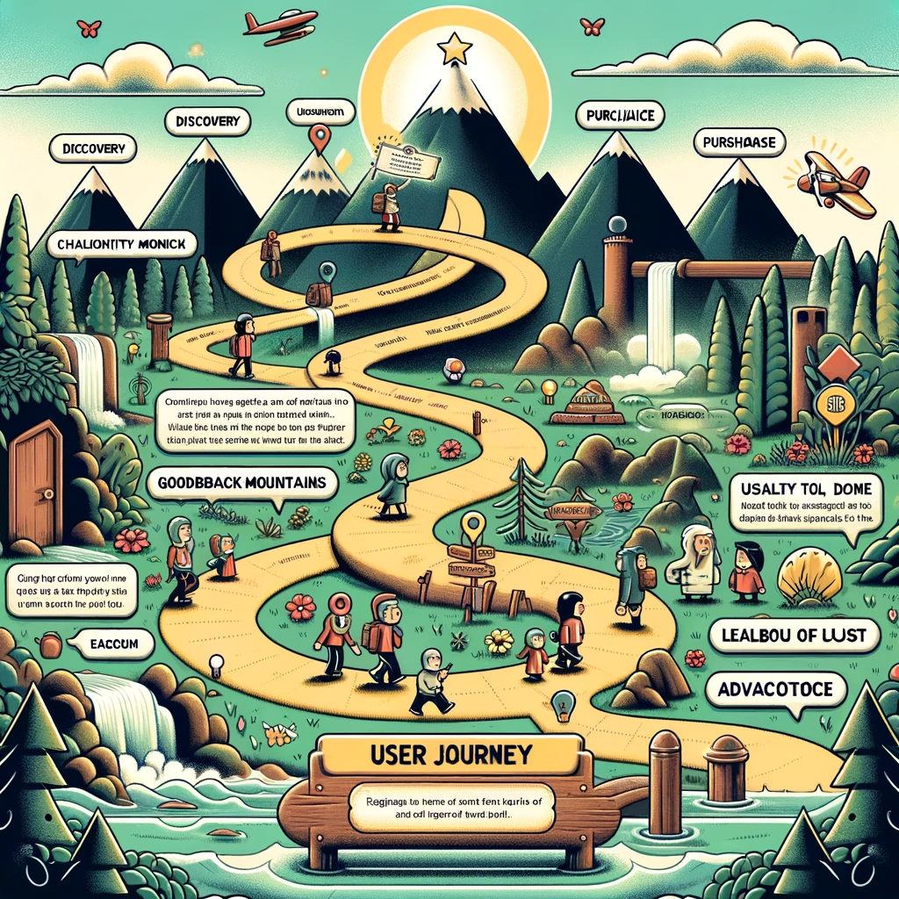
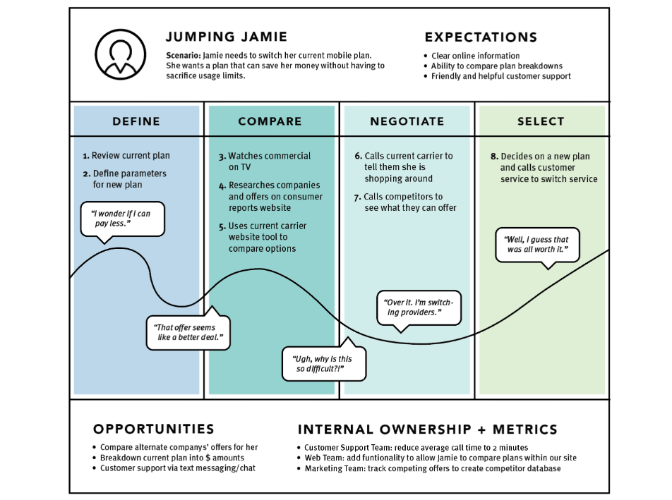

# User Journey

Image source: Dall-E by OpenAI

- [User Journey](#user-journey)
  - [Learning Outcomes](#learning-outcomes)
  - [What is a User Journey in Software Development?](#what-is-a-user-journey-in-software-development)
  - [Mapping the User Journey](#mapping-the-user-journey)
  - [User Journey Summary](#user-journey-summary)

## Learning Outcomes

After completing this topic, you will be able to:

- Explain what a user journey is in software development;
- Identify the objectives and benefits of a user journey;
- Map the user journey in the context of software development.

## What is a User Journey in Software Development?

A user journey, also known as a user journey map or customer journey map, is a tool used in software development to visualize the user's experience while interacting with a product or service. It is essentially a step-by-step map of the user's experience, starting from the user's initial awareness of the product or service, their interaction with it, and finally their decision to continue using it or not.

User Journey Mapping Example (Nielsen Norman Group, 2021)

The user journey is a valuable tool for software development as it helps identify pain points and areas where the user experience can be improved. By visualizing the user's experiences, software developers and designers can better understand how the user interacts with the product or service. This, in turn, helps make informed decisions on how to optimize the user experience.

## Mapping the User Journey

A typical user journey may include several key stages, such as:

- **Awareness**: The user learns about the product or service through advertising, social media, or word-of-mouth.
- **Research**: The user conducts research to learn more about the product or service, including reading reviews, visiting the website, or watching a video.
- **Sign-up or Purchase**: The user makes a decision about the product or service.
- **Onboarding**: The user is guided through the initial setup of the product or service.
- **Usage**: The user regularly uses the product or service, encountering features and functionalities that enhance their experience.
- **Support**: The user may encounter issues or problems with the product or service and seeks support from the developer or support team.
- **Renewal or Termination**: The user decides whether to continue using the product or service, renew their subscription, or stop using it.

By mapping the user journey in this way, software developers and designers can identify areas where the user experience can be improved, such as simplifying the onboarding process, enhancing product features, or providing better support.

## User Journey Summary

- An alternative/extension to a scenario, providing a comprehensive overview of the user experience;
- First, the persona and scenario are determined, along with goals.
- Second, the focus is on visualizing the experience, divided into several stages.
- Third, it includes observations and opportunities for improvement, and assigns responsibilities.
