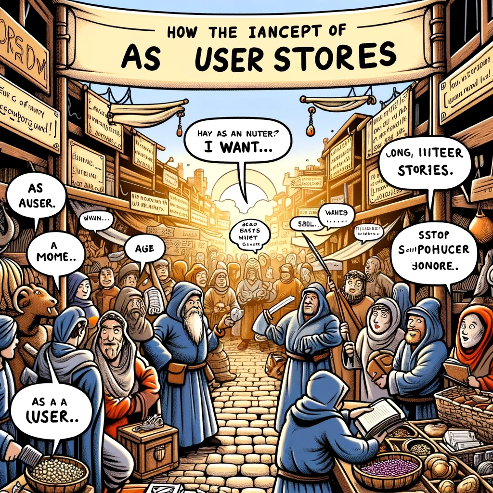

# User Story

Image source: Dall-E by OpenAI

- [User Story](#user-story)
  - [Learning Outcomes](#learning-outcomes)
  - [What is a User Story?](#what-is-a-user-story)
  - [Writing User Stories](#writing-user-stories)
  - [Example](#example)

## Learning Outcomes

After completing this topic, you will be able to:

- Explain what a user story is;
- Identify the objectives and benefits of a user story;
- Write user stories in the context of software development.

## What is a User Story?

A user story is a simple, one-sentence description of a software application's feature or functionality written from the end user's perspective. User stories are a common technique used in agile software development to describe application requirements in a way that is easy to understand and prioritize.

Here is an example of a user story:

`As a registered user, I want to reset my password so that I can regain access to my account if I forget my password.`

## Writing User Stories

To write a user story, follow these simple steps:

- **Identify the user**: Start by identifying the user or role from whose perspective the story is written. This can be a specific user or a group of users with a similar need.
- **Describe the action**: Next, describe the action the user wants to perform. This should be a simple and clear description of what the user wants to do.
- **State the benefit**: Finally, state the benefit the user will gain from performing this action. This should describe why the user wants to perform the action and what they hope to achieve.

When writing user stories, it is important that they are concise and focused on the end user's needs. User stories should also be written in simple and understandable language and **prioritized** so the development team can quickly determine which stories are most important to implement.

## Example

Here is an example of a prioritized list of user stories for a fictional e-commerce website.

1. As a guest user, I want to browse products so that I can find something to buy.
2. As a registered user, I want to add products to my shopping cart so that I can keep track of what I want to buy.
3. As a registered user, I want to be able to pay for my items so that I can complete my purchase.
4. As a registered user, I want to see my order history so that I can see what I have previously bought.
5. As a registered user, I want to write product reviews so that I can share my experiences with other users.
6. As a registered user, I want to update my account information so that I can keep my details current.

In this example, the user stories are prioritized based on their importance to the core functionality of the website. The first three stories focus on the basic process of finding and purchasing goods, while the later stories focus on additional features that enhance the user experience. This prioritized list can help the development team focus on the most important stories first and ensure that the core functionalities of the website are implemented correctly.
